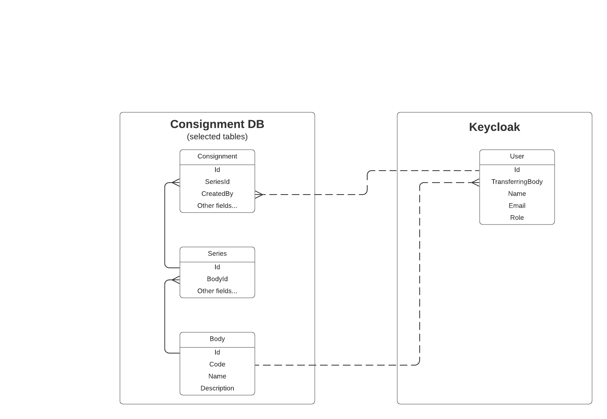

# 6. User data model

**Date**: 2020-03-06

## Context

We have [decided][user-auth-adr] to use the OAuth2 provider Keycloak for user
authentication. This means that user account details will be stored in
Keycloak's database, separately to the main consignment database.

There is some overlap between user data model and consignment data model:

* Users belong to transferring bodies, and series belong to transferring bodies
* Users are linked to consignments that they create, and (at least for the MVP)
  should only be able to see their own consignments

Users will also eventually need roles to distinguish users who create their own
consignments from users who need need to see other users consignments, such as
Departmental Record Officers or possibly digital archivists within The National
Archives.

We need to make it possible for TDR admins to add and update users, including
easily assigning them to departments and roles, and use that information in
other parts of the TDR system such as the API or any reporting system.

[user-auth-adr]: 0005-user-authentication.md

## Decision

Store user information in Keycloak. Use the same user and transferring body IDs
in Keycloak and the consignment DB, but don't duplicate any other information.

When the consignment database needs to store a reference to a user (e.g. a
record of which user created a consignment), store the Keycloak user ID.

Store details of transferring bodies in the consignment DB, including a code
which is referenced in the user's data in Keycloak.

Add the transferring body and any user roles to the access token. This token
will be passed from the frontend to the consignment API, which can use the user
ID or body in the token to authorize requests.

If the consignment API or analytics tool needs more information, such as the
name of a user, it can query the Keycloak REST API.

A rough diagram of the data model is shown below. The data may not be stored
exactly like this in Keycloak, and field names may be different in the
consignment DB, but the diagram does show which system is responsible for
different fields, the relationship between the systems. Dotted lines represent
references between databases, rather than strict foreign keys.

### Administration

Data in Keycloak can be updated by a developer or admin through the Keycloak
admin site.

We will eventually have to build an admin interface to update Body and Series
data, but for now we will build an import script which lets a developer add new
bodies and series.
