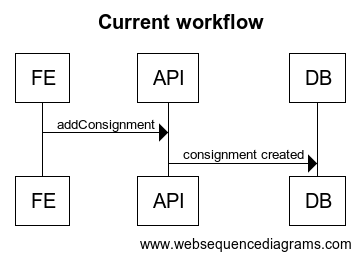
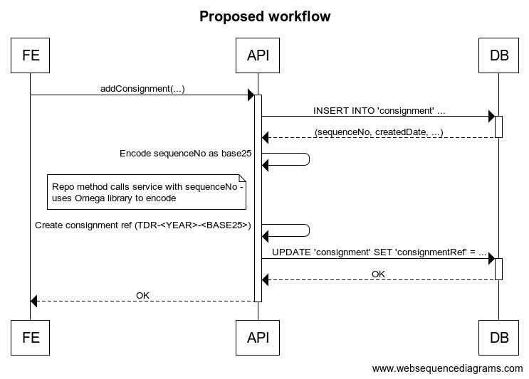

# base25 encoding for consignment references

**Date:** 2020-11-13

## Context

As part of the 'transfer summary' page, the user will see a 'consignment reference' to identify their consignment (which can be useful if a user needs to contact us about a specific consignment).
The user will also be able to see the progress of multiple consignments on the 'transfer history' page, which will use the consignment reference to identify separate transfers.
The TDR system already generates a UUID when a consignment is created, but this can be difficult for users to read or work with.

Utilising the `SeriesID` was considered to show the users, but one of the long-term goals for TDR is to remove the concepts of series', so introducing the user to these before removing them did not seem sensible.

Discussions were also had about using the transferring body/code to identify a consignment, but was decided against due to potential for these to change.

The TDR team decided that it would be helpful to generate a separate reference for users to refer to consignments using a base25 alphabet.
With the introduction of the Base25, the TDR backend will also be able to use either the UUID or consignment reference to look up consignments, but users will exclusively see the consignment reference within TDR pages (though TDR **URLs** will still show the consignment UUID within, since these will be used by the TDR backend)

Base25 was specifically chosen due to its ability to represent numeric identifiers through alpha-numeric codes, this is especially pertinent when it comes to longer numeric identifiers, as base25 can represent this in a more succinct and easy to read manner.
A custom version of Base25 is also used within other TNA projects (referred to as Generated Catalogue Reference Base25, GCR Base25 or GCRb25), and TDR utilising it will keep references to a similar standard to those used within different projects.
It also allows for specific letters and numbers to be removed from the list of possible characters, limiting the possibility that a reference can be created that is unintentionally offensive.
Though we are not creating references to replace the references created by other services, they will continue to create their own that may be similar to the ones created by TDR.

We came to the decision that we liked the format:

`TDR-YEAR-GCRBASE25REFERENCE`

`TDR` - since the consignment will be transferred using the TDR service

`YEAR` - year the consignment created (not completed) - as transfers may take weeks/months rather than a set time period, so we do not know when a consignment will be completed.

`GCRBASE25REFERENCE` - created once the consignment is assigned an incremental ID, which will be encoded to a GCR Base25 alpha-numeric code.

An example of this could be: 

`TDR-2020-MTB`

Where `MTB` is the GCR Base25 encoding of the id number `6000`

## Options considered for the incremental ID

We need an incremental ID to feed into the encoding method to create the GCR Base25 alpha-numeric reference, there are two options for the incremental id creation.

### Option 1: PostgreSQL Serial ID

PostgreSQL has a built-in incremental ID feature (Serial). A serial is a pseudo-type that a column can use that tells PostgreSQL to automatically create a sequence and put its value in the associated column of the linked table.

#### Advantages

* Creates own sequence and reference to this
* Can be added to columns in an existing table

#### Disadvantages

* Not very customisable

### Option 2: PostgreSQL Sequence

A sequence is a database object that can generate a big-int (8-byte) and be associated with specific tables. Using a sequence is slightly more manual, but  allows for many customisable options (min/max value, starting point, cycle/no-cycle).

#### Advantages

* We can state specifically that we don't want the value to cycle when max-value is reached (extremely unlikely to happen)
* We can start from a specific value, which would be useful if tables/db is dropped and sequence needs to be initiated again.
* Can be added to existing tables

#### Disadvantages

* A slightly more manual set up, but behaves the same as serial once initiated.

## Options considered for encoding

### Option 1: DRI code

We could manually encode these ID numbers to base25 utilising code that is similar to that written for the [DRI](https://nationalarchivesuk.sharepoint.com/sites/DA_DPT/Systems/Forms/AllItems.aspx?id=%2Fsites%2FDA%5FDPT%2FSystems%2FDigital%20Records%20Infrastructure%2FDocumentation%2FGenerated%20Catalogue%20References%20%2D%20Draft%20v1%2E0%2Epdf&parent=%2Fsites%2FDA%5FDPT%2FSystems%2FDigital%20Records%20Infrastructure%2FDocumentation&RootFolder=%2Fsites%2FDA%5FDPT%2FSystems%2FDigital%20Records%20Infrastructure%2FDocumentation&FolderCTID=0x012000E56AFAD10E754045898F8F352035CA1F00E09F204D3696E04193FD4FFBF9EA85B7) project in 2014. 
This code could be copy and pasted within the TDR consignment API to be used as we see fit. We would explicitly define the required list of available alpha-numeric values and create our own encode/decode functions according to this 'alphabet'.

#### Advantages

* Customisable to what we want - especially if our requirements change
* Easy to read for humans and see what it does at first glance

#### Disadvantages

* Based on code that is slightly older
* Could potentially be bulky to incorporate into the consignment API

### Option 2: [Omega Catalog Identifier tools (Scala)](https://github.com/nationalarchives/oci-tools-scala)

This [library](https://search.maven.org/artifact/uk.gov.nationalarchives.oci/oci-tools-scala_2.13/0.2.0/jar) can encode to any specified base*N*, and decode back to base10. The Omega library has some pre-specified 'alphabets' included within, one of which is GCRb25, meaning an alphabet does not need to be explicitly created to utilise this code.
The library is a little more complex than utilising the 2014 DRI code, and more than one function needs to be called to encode from an integer to the correct code, but working with this is relatively straight-forward.

#### Advantages

* Can encode to any base*N* not just Base25/GCRb25
* Already exists as a tool, meaning encoding functionality does not need to be created by TDR team
* Error handling built in

#### Disadvantages

* Open source - the aim of the project may change and affect the way the TDR team can use the library
* Less customisable - more generalised

## Decisions

To create the format of `TDR-YEAR-GCRBASE25REFERENCE` we have made the following decisions:

The PostgreSQL sequence is much more customisable to our needs and can be started from any specified value, which would be very helpful should any tables be dropped from the database. We would use this to create a bigInt incremental ID, with no-cycle to prevent it rolling back to the min-value once the max-value is reached.

Utilising the Omega library is a good way to start working on the encoding. If the project changes (like any open-source project can) we have the option to use the 2014 DRI code if needed.

## Current consignment workflow

The current consignment workflow is as seen below. The frontend queries the API upon the user selecting a series (form submission), which will use slick to insert a row into the 'Consignment' table with the relevant information.

## Proposed workflow with tools selected

A proposal for a workflow to include the tools discussed above is to edit the existing 'Consignment' table to add two columns, one for the sequential integer (using the PostgreSQL sequence) and another for the full consignment reference.
We will have to create service methods within the consignment API to encode the Base25 reference (using the Omega library) and create the complete reference (TDR-YEAR-GCRBASE25).
The full consignment reference will then be inserted into the 'Consignment' table in the existing row for the specified consignment.

This can be seen below in a sequence diagram:

