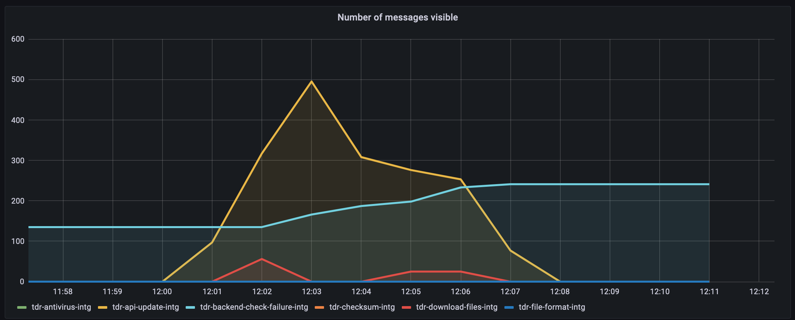

# 20. Increase message visibility timeout in file check queues

**Date:** 2021-07-05

## Context

When files are uploaded to TDR, they trigger a series of file check Lambda
functions which are coordinated by messages sent to and from SQS queues. See
[ADR 13] for a full description of the workflow.

This works well for small consignments, but if you upload more than a few
hundred files, it can overload the API. This is because many instances of the
file download and API update Lambdas start running in parallel, and they all
call the API at the same time.

[ADR 13]: 0013-file-check-queues-and-lambdas.md

### Failure queue bug

All of the file check SQS queues currently have `maxReceiveCount` set to 3,
which means each message should be processed by Lambda up to 3 times until it
succeeds. If every attempt fails, the queues are configured to send the message
to a dead letter queue called `tdr-backend-check-failure-<env>`.

This was mostly working as intended, but we noticed that some messages were
occasionally sent to the failure queue even when the Lambda eventually succeded.
This is a problem because it makes it hard to distinguish between file checks
that completely failed and file checks that succeeded when retried. You could
work out the answer for a specific file by checking the file check logs, but it
means that the failure queue is not very useful for monitoring the general
health of the backend checks.

For example, here are the messages in each file check queue during an upload of
500 small files:



The yellow and red peaks show the API update and download file messages waiting
to be processed. (The antivirus, checksum and file format messages don't appear
because they are picked up by Lambda so quickly.) You can see that as the
messages are processed, the number of message on the _failure_ queue grows from
135 to 241. It looks like 106 file check messages failed to be processed at all.

The state of the failure queue isn't reflected in the database, though. All of
the file check results have been stored, and the user is taken to the file check
results page as normal.

### Cause of bug

We're not completely sure this is the cause, but as far as we can tell, the
issue is that the messages are sometimes being retried by Lambda too quickly,
before an earlier attempt has finished.

Retries are not actually triggered by a Lambda failure. SQS retries are based on
a property of the queue called the [visibility timeout]. When a consumer like
Lambda receives a message from the queue, SQS keeps the message in the queue but
temporarily marks it as not visible. If the consumer successfully handles the
message, it deletes it from the queue. Lambda does this automatically if it does
not exit with an error. If, however, the consumer does not delete the message,
the visibility timeout eventually expires, and SQS sends the message the next
time a consumer requests new messages.

This means that you need to set the visibility timeout to be at least as long as
the Lambda function's timeout. Otherwise the message will become visible again
while the first Lambda attempt is running.

We thought we had configured the backend checks to handle this. These are our
current timeouts in Lambda and SQS:

| Process        | Lambda timeout | Visibility timeout |
| -------------- | -------------- | ------------------ |
| Download files | 3 min          | 3 min              |
| Checksum       | 3 min          | 3 min              |
| Antivirus      | 3 min          | 3 min              |
| FFID           | 15 min         | 15 min             |
| API update     | 20 s           | 30 s               |

All of the SQS visibility timeouts are at least as long as the Lambda timeouts.
Many of the messages that are being delivered to the failure queue come from the
API update process, which has a visibility timeout which is 10 seconds _longer_
than the Lambda timeout.

The visibility timeout is longer than the Lambda timeout, but this is not the
only elapsed time that you need to take into account. As soon as the message is
pulled from the queue, the visibility timeout clock starts ticking. Lambda needs
to create an execution environment and initiaize the function before the Lambda
code itself starts running.

We checked the initialization times for the API update Lambda using CloudWatch
Insights:

```
fields @duration, @billedDuration, @initDuration
| sort @initDuration desc
```

This showed that this particular Lambda can take up to 6 seconds to initialize,
presumably because the Java Lambda runtime is quite slow to start up.

Adding this 6 seconds to the 20 second Lambda timeout still doesn't take us to
the 30 second message visibility timeout. Our best guess is that the Lambda
provisioning adds another few seconds to the startup, which causes the total
time to go past the message visibility. Unfortunately, we haven't found a way to
measure this, but it seems plausible because these Lambdas have very uneven
traffic: there may well be no uploads for hours, then a burst of 1000 files
uploaded at once.

Further evidence that this is the problem comes from the timestamps of the
messages which end up on the failure queue. They always come from the first
minute in the batch of uploads, which coincides with the Lambda functions being
cold.

The symptoms of this problem are very similar to that described in this blog
post about [Lambda concurrency limits]. The key difference is that in the
situation described in the blog post, the reason that Lambdas take longer than
the message visibility timeout is because they are being delayed by throttling.
We have checked the `Throttles` metric in CloudWatch, and we are not hitting the
throttle limit yet. But we are handling large bursts of traffic, so we think we
are seeing similar delays caused by provisioning.

In their [guide to using SQS with Lambda][sqs-lamba], AWS actually recommend
that you set a visibility timeout that is **6 times** larger than the Lambda
timeout to avoid message expiry. The Lambda concurrency blog post mentioned
above quotes the AWS advice, but also suggests that 3 times longer is
sufficient.

[visibility timeout]: https://docs.aws.amazon.com/AWSSimpleQueueService/latest/SQSDeveloperGuide/sqs-visibility-timeout.html
[Lambda concurrency limits]: https://zaccharles.medium.com/lambda-concurrency-limits-and-sqs-triggers-dont-mix-well-sometimes-eb23d90122e0
[sqs-lambda]: https://docs.aws.amazon.com/lambda/latest/dg/with-sqs.html#events-sqs-queueconfig

## Decision

Set the visibility timeout to 3 times the Lambda timeout for all file check
Lambdas (including the file download and API update Lambdas). From some initial
testing, this is enough to fix the invalid failure messages.

This change will mean that retries take much longer than they do at the moment.
To mitigate this, add extra error handling to each of the file check Lambdas
which calls the SQS `ChangeMessageVisibility` API endpoint to set the visibility
to 0 if the message processing has failed. This means the message will be placed
back on the queue immediately, so it will be retried quickly. If the error
handling doesn't run (e.g. because the Lambda times out), the messages will be
retried once its original timeout expires.

To make it easier to test and debug these changes, set the message batch size to
1 for all of the Lambdas.

These are the new values we will start with. We might tune them later if we
learn more about the file check performance.

| Process        | Lambda timeout | Visibility timeout | Batch size |
| -------------- | -------------- | ------------------ | ---------- |
| Download files | 3 min          | 9 min              | 1          |
| Checksum       | 3 min          | 9 min              | 1          |
| Antivirus      | 3 min          | 9 min              | 1          |
| FFID           | 15 min         | 45 min             | 1          |
| API update     | 20 s           | 1 min              | 1          |
