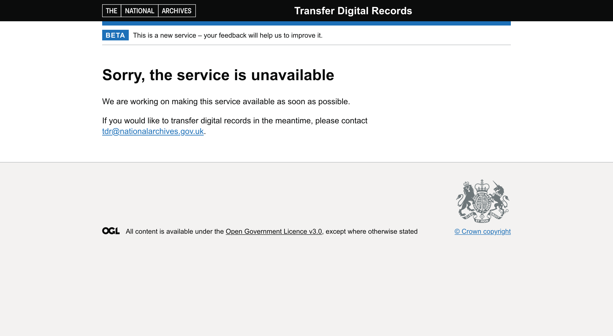
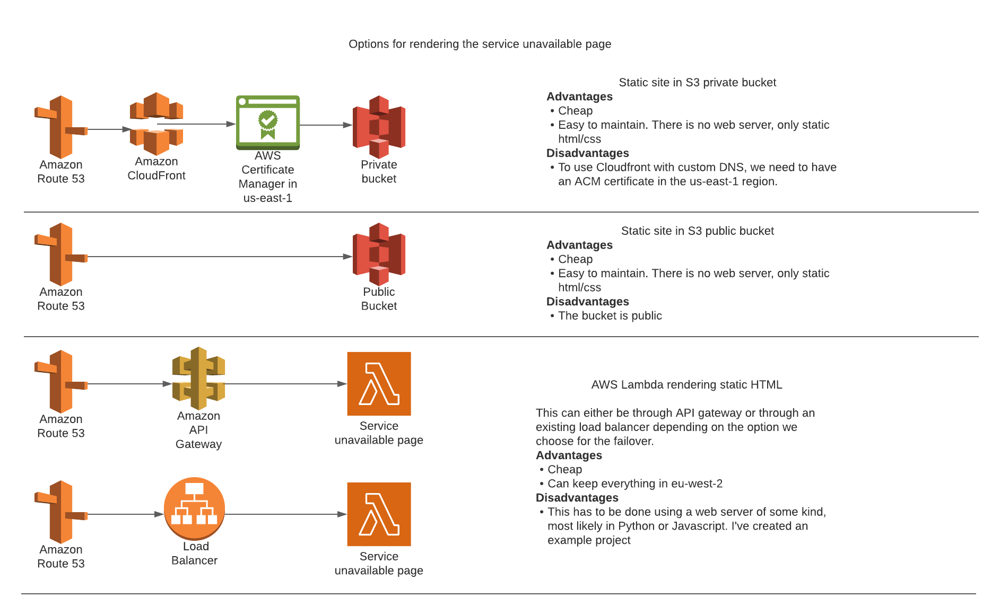
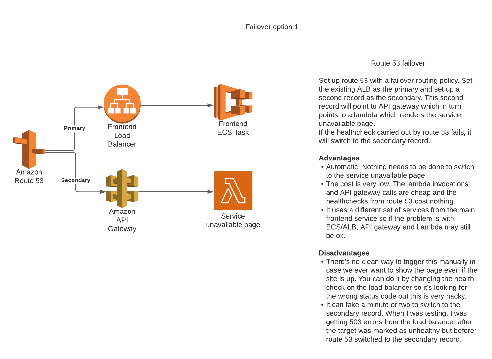
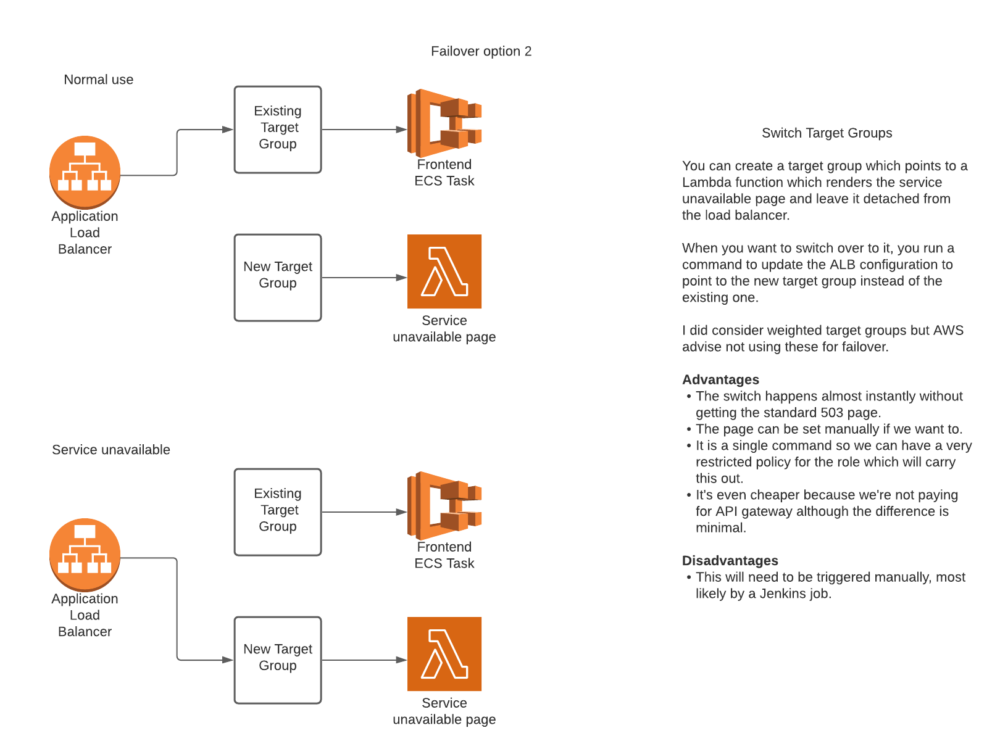
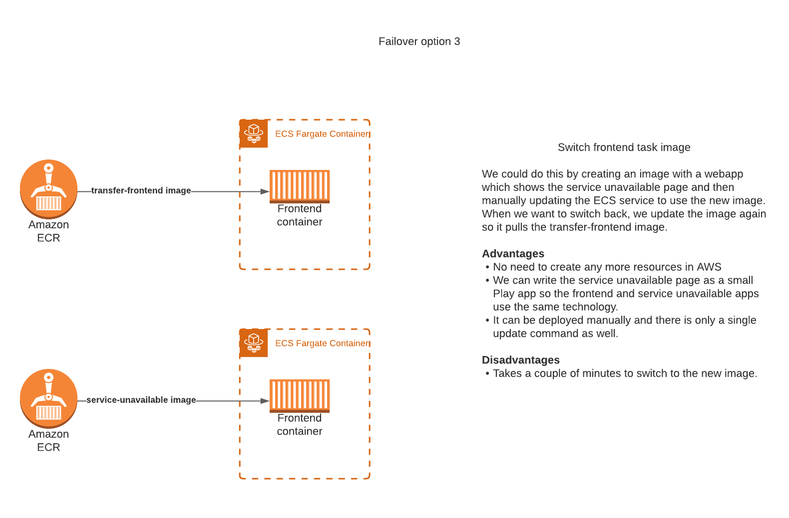

# 20. Deploying a service unavailable page 

**Date:** 2021-07-14

## Context
We need a mechanism to manually deploy a service unavailable page. There are two main reasons we might want to do this. 
* There is a serious issue with the site that we can't fix immediately.
* We want to carry out maintenance which will affect the service. 

The page will be a single static html page which will be displayed when a user goes to any of the https://tdr.nationalarchives.gov.uk/* urls.

## Evaluation criteria
* We must be able to deploy the page manually.
* We should avoid creating any permanently running services for this page as it will be used rarely.
* The switch to the new page should only take seconds.
* It should be easy for anyone on the TDR team to deploy.
* It should be easy to switch back to the TDR app.

## Options considered

### Options for rendering the page

### Options for carrying out the switchover

## Decision

We are going to use the target group switching method. This allows us to deploy the page manually and the changes are visible to the user almost instantly.

Because of this decision, we were constrained in how we implement the page. Target groups can forward to IP addresses or to lambdas but not to static sites hosted in S3 or ECS containers in a private subnet without using other resources like Cloudfront which we decided is too large an architecture change for this use case.

We will create this page as a lambda, using Python to create a small web server which will render the html and also load the css and images that we need.