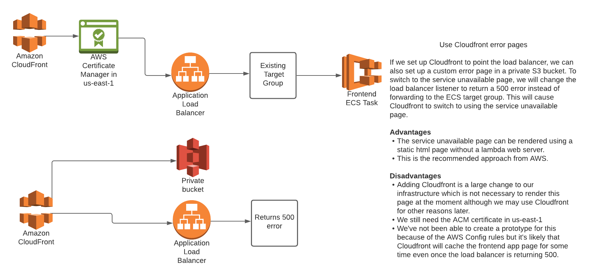

# 20. Deploying a service unavailable page 

**Date:** 2021-07-14

## Context
We need a mechanism to manually deploy a service unavailable page. There are two main reasons we might want to do this. 
* There is a serious issue with the site that we can't fix immediately.
* We want to carry out maintenance which will affect the service.

This will be a rare occurrence as almost all deployments will be done with zero downtime. 

The page will be a single static html page which will be displayed when a user goes to any of the https://tdr.nationalarchives.gov.uk/* urls.

## Evaluation criteria
* We must be able to deploy the page manually.
* We should avoid creating any permanently running services for this page as it will be used rarely.
* The switch to the new page should only take seconds.
* It should be easy for any developer on the TDR team to deploy.
* It should be easy to switch back to the TDR app.

## Options considered

### Options for rendering the page

### Static site in S3 private bucket
#### Advantages
* Cheap
* Easy to maintain. 
* There is no web server, only static html/css

#### Disadvantages
* To use Cloudfront with custom DNS, we need to have an ACM certificate in the us-east-1 region.

### Static site in S3 public bucket
#### Advantages
* Cheap
* Easy to maintain. There is no web server, only static html/css
#### Disadvantages
* The bucket is public

### AWS Lambda rendering static HTML

This can either be through API gateway or through an existing load balancer depending on the option we choose for the failover.
#### Advantages
* Cheap
* Can keep everything in eu-west-2
#### Disadvantages
* This has to be done using a web server of some kind, most likely in Python or Javascript. We've prototyped this to check it would work.

### Options for carrying out the switchover

### Route 53 failover

Set up route 53 with a failover routing policy. Set the existing ALB as the primary and set up a second record as the secondary. This second record will point to API gateway which in turn points to a lambda which renders the service unavailable page.
If the healthcheck carried out by route 53 fails, it will switch to the secondary record.

#### Advantages
* Automatic. Nothing needs to be done to switch to the service unavailable page.
* The cost is very low. The lambda invocations and API gateway calls are cheap and the healthchecks from route 53 cost nothing.
* It uses a different set of services from the main frontend service so if the problem is with ECS/ALB, API gateway and Lambda may still be ok.

#### Disadvantages
* There's no clean way to trigger this manually in case we ever want to show the page even if the site is up. You can do it by changing the health check on the load balancer so it's looking for the wrong status code but this is very hacky.
* It can take a minute or two to switch to the secondary record. When I was testing, I was getting 503 errors from the load balancer after the target was marked as unhealthy but beforer route 53 switched to the secondary record.

### Switch Target Groups

You can create a target group which points to a Lambda function which renders the service unavailable page and leave it detached from the load balancer.

When you want to switch over to it, you run a command to update the ALB configuration to point to the new target group instead of the existing one.

I did consider weighted target groups but AWS advise not using these for failover.

#### Advantages
* The switch happens almost instantly without getting the standard 503 page.
* The page can be set manually if we want to. 
* It is a single command so we can have a very restricted policy for the role which will carry this out.
* It's even cheaper because we're not paying for API gateway although the difference is minimal.

#### Disadvantages
* This will need to be triggered manually, most likely by a Jenkins job.

### Switch frontend task image

We could do this by creating an image with a webapp which shows the service unavailable page and then manually updating the ECS service to use the new image.
When we want to switch back, we update the image again so it pulls the transfer-frontend image.

#### Advantages
* No need to create any more resources in AWS
* We can write the service unavailable page as a small Play app so the frontend and service unavailable apps use the same technology.
* It can be deployed manually and there is only a single update command as well.

#### Disadvantages
* Takes a couple of minutes to switch to the new image.

### Cloudfront error pages

If we set up Cloudfront to point the load balancer, we can also set up a custom error page in a private S3 bucket. To switch to the service unavailable page, we will change the load balancer listener to return a 500 error instead of forwarding to the ECS target group. This will cause Cloudfront to switch to using the service unavailable page.

#### Advantages
* The service unavailable page can be rendered using a static html page without a lambda web server.
* This is the recommended approach from AWS.

#### Disadvantages
* Adding Cloudfront is a large change to our infrastructure which is not necessary to render this page at the moment although we may use Cloudfront for other reasons later.
* We still need the ACM certificate in us-east-1

## Decision

We are going to use the target group switching method. This allows us to deploy the page manually and the changes are visible to the user almost instantly.

Because of this decision, we were constrained in how we implement the page. Target groups can forward to IP addresses or to lambdas but not to static sites hosted in S3 or ECS containers in a private subnet without using other resources like Cloudfront which we decided is too large an architecture change for this use case.

We will create this page as a lambda, using Python to create a small web server which will render the html and also load the css and images that we need.