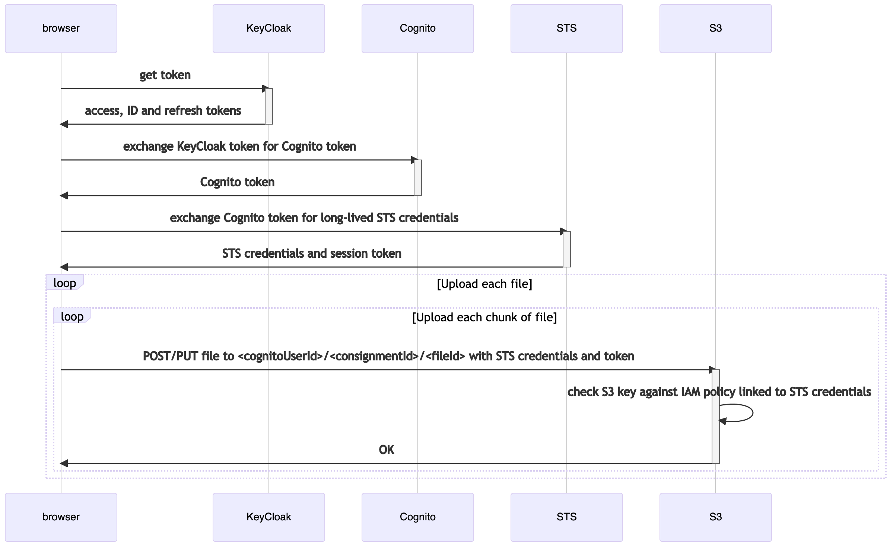
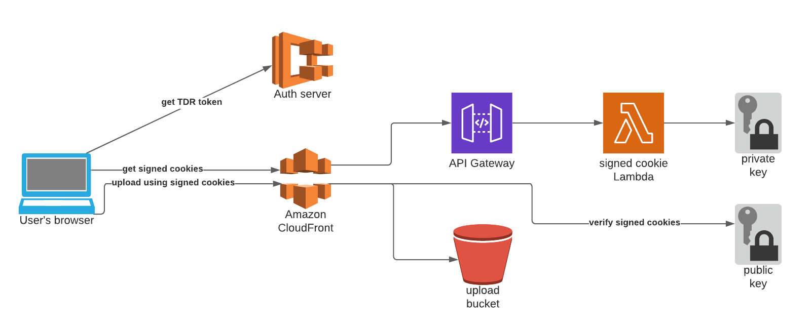
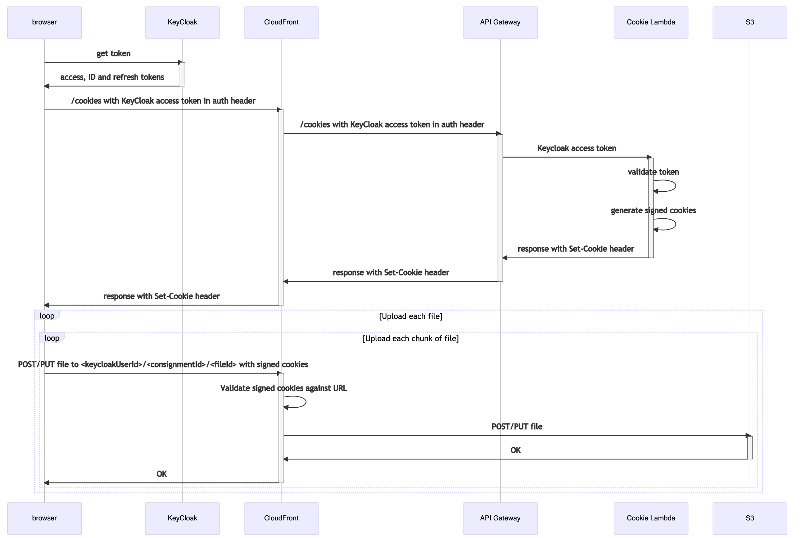

# 22. Proxy S3 uploads through CloudFront

**Date:** 2021-09-17

## Context

When a user uploads a file to TDR, the file is currently sent from the JavaScript running in the user's browser straight
to the AWS S3 upload bucket. This means that there are several HTTP requests from the user's browser to AWS domains:

- `cognito-identity.eu-west-2.amazonaws.com`: Exchange a TDR access token for a Cognito token
- `sts.amazonaws.com`: Exchange the Cognito token for temporary AWS credentials and a session token, which have a longer
  expiry than the Cognito token
- `tdr-upload-files-dirty-<environment>.s3.eu-west-2.amazonaws.com`: Upload the files

The sequence of requests looks like this (simplified slightly - CORS requests and multiple requests to the auth server
and S3 are omitted for clarity):



Some TDR users are on restricted networks, and the upload step completely fails. From what we could see on a video call
with one user, the network calls to TDR domains succeed but the ones to `amazonaws.com` are being blocked.

We think that if we can replace requests to `amazonaws.com` with requests to `tdr.nationalarchives.gov.uk`, these users
will be able to upload files.

## Options

All the options we considered involved proxying requests to S3 through a service that we could assign a TDR domain name
to. We didn't consider moving away from S3, because it integrates well with the processes that happen after the file is
uploaded, such as the file check and export tasks.

### Proxy options

Whatever option we choose, it will have to solve the problem of sending the data to S3, and authorizing the request so
that users only have access to S3 objects associated with their own consignments. Another constraint is that we'd like
to keep using the AWS JavaScript SDK, because the [S3 upload] method automatically handles multipart uploads by chunking
the file and sending the start and end requests to combine the chunks in S3.

We considered running NGINX in ECS, or writing proxy code and running it in Lambda or ECS. We didn't look very far into
these options because it means maintaining an extra service. We would also have to proxy the requests to Cognito and
STS, or find some way to use the AWS JavaScript SDK to send Keycloak tokens with the upload requests.

We also looked into [S3 website endpoints], which allow you to assign a custom domain in Route 53 to an S3 bucket. This
was definitely not an option because it only supports requests over plain HTTP. You cannot make requests using HTTPS
URLs because there is nowhere to add a certificate for SSL termination.

We considered using API Gateway as a proxy. As with the Lambda or ECS options, we would either have had to proxy the
Cognito and STS requests too, or found a way to add the Keycloak token to the AWS JavaScript SDK upload request. API
Gateway also has a maximum request time of 30 seconds, which might not be enough for users uploading large files over
slow connections. This might have required us to reduce the default chunk size when splitting the file for upload.

The main option we looked at was using CloudFront as an upload proxy. We built a spike in the Sandbox environment to
check that it would work (see [TDR-1261]). The main reason that this didn't stand out as the obvious option from the
start is that most documentation around CloudFront and S3 assumes that you want to use them to host a static website, so
it was tricky to find the right guides to using CloudFront as an upload proxy. But this does seem to be an expected way
to use CloudFront, so it looks like a good option for us.

### Authorisation options

We considered these options for restricting users' permissions to upload files:

- Keep the current system of Keycloak, Cognito, and STS credentials
- Use the user's Keycloak access token directly
- Use one of CloudFront's systems for restricting content: signed cookies or signed URLs

Keeping the existing token exchange process would have meant proxying two extra requests: one to Cognito and one to STS.
It's already quite awkward to have to use three sets of tokens (Keycloak, Cognito and STS).

Another disadvantage of using Cognito tokens for S3 authorisation is that the IAM policy has to use the Cognito ID as
part of the object key to restrict S3 uploads to the user's own S3 "folder". This would be fine, except we have no easy
way to link a Keycloak user ID to a Cognito ID. Cognito will only generate a user ID when given a valid token for the
Keycloak user, which requires the user to authenticate themselves, so an admin user cannot convert an arbitrary Keycloak
ID to a Cognito ID or vice-versa.

Using just the Keycloak token would simplify the workflow. If we use CloudFront, we could configure an [edge function]
to validate the token and authorise the request. The downside is that it's not obviously compatible with the AWS
JavaScript SDK. The SDK sets an `Authorization` header based on AWS credentials. It's not clear how you can add a custom
header based on the Keycloak token. So if we wanted to use just the Keycloak tokens to authorise the S3 upload, we would
have to write more client-side JavaScript to handle multipart uploads to replace the call to the SDK. It would still be
worth considering this option if the assumptions change in future.

We ruled out the idea of using [CloudFront signed URLs]. You have to generate a signed URL for every file, which is
inconvenient for uploads with thousands of files because the signed URLs would have to be fetched from a server, e.g.
the consignment API. We also don't think signed URLs are compatible with the AWS JavaScript SDK, because the SDK only
lets you set a domain name, not the whole URL including the query parameters that contain the CloudFront signatures.

The other option built into CloudFront is [signed cookies]. These _are_ compatible with the AWS SDK, because if you
set the `xhrWithCredentials` option to `true`, then any cookies associated with the CloudFront domain are sent with
every request to that domain. The signature in the cookie can use wildcards, so we can use the same cookie when
uploading multiple files to the same S3 user "folder". They require an extra authorisation step to generate the signed
cookies, but this can be a Lambda function that validates the Keycloak token and generates signed cookies based on the
user's Keycloak ID.

## Decision

Proxy requests to S3 through CloudFront, using signed cookies for authorisation.

Instead of uploading directly to S3, the frontend will direct uploads to a domain like
`upload.tdr.nationalarchives.gov.uk`, which is associated with a CloudFront instance. CloudFront will send those
requests to the S3 upload bucket.

Requests will be authorised using CloudFront signed cookies. These will be generated by a Lambda function which sits
behind the same CloudFront instance. The reason for using the same CloudFront instance is that the service which returns
the `Set-Cookie` header (the Lambda) must be on the same domain as the the service which requires the cookie (the
CloudFront upload request). You can [set a cookie on a shared parent domain][RFC 6265], such as
`tdr.nationalarchives.gov.uk`, but then the cookie would be sent to all subdomains unnecessarily, such as the auth and
API domains.

API Gateway is required as a bridge between CloudFront and Lambda, because CloudFront needs to proxy requests to a
service with a fixed URL.

This diagram shows the services involved in the new upload process:



The sequence of requests looks like this (again, omitting CORS preflight requests and the multiple OAuth2 requests):



The frontend needs to be updated to send uploads to the TNA domain hosted on CloudFront rather than straight to S3. The
AWS JavsaScript SDK can be configured to do this by setting the S3 config:

```
AWS.config.s3 = {
  endpoint: "https://upload.tdr.nationalarchives.gov.uk",
  s3BucketEndpoint: true
}
```

### Security

The security considerations are very similar with the new architecture. The uploads will be authenticated with signed
cookies rather than Cognito token.

Restrictions on the credentials are similar to before: users with STS credentials or a signed cookie can send PUT
requests to upload data, but cannot send GET requests to read it. We still have versioning enabled on the upload bucket,
so data cannot be lost by overwriting it.

Authorisation is also similar to before. STS credentials and signed cookies both allow the user to upload files with an
S3 object prefix that matches their user ID. This acts as a "folder" in S3, so a user only has permission to upload
files to their own folder.

There is an extra certificate that needs to be stored securely, which is the one used for signing cookies. We will
store, encrypt and rotate this in the same way as other secret values in TDR.

There are also a couple of advantages to the new approach:

- When signing the cookies, we can configure an IP address that is allowed to use the cookie. CloudFront checks the IP
  address that made the HTTP request against the IP address in the signed cookie policy. This means that a leaked cookie
  could not be used from outside the original user's network.
- The signed cookie expiry can be fairly short, because the JavaScript can call the Lambda repeatedly to get new
  cookies. Before, the STS credentials had to be fairly long-lived - the lifetime had to be longer than the time it
  might take to upload a single file. This is because the credentials had to be set before uploading each file - there
  was no way to reset them in the middle of an upload. If we use the signed cookie method, we can refresh the cookies in
  a separate loop to the file upload, so the cookie lifetime can be short, which reduces the damage that can be done by
  an attacker who has a signed cookie.

### Cost

We do not expect this change to significantly increase the cost of uploads. The uploaded data (which may be multiple GB
per consignment) now passes through an extra service (CloudFront), but CloudFront ingress pricing is per-request rather
than per-GB.

[S3 upload]: https://docs.aws.amazon.com/AWSJavaScriptSDK/latest/AWS/S3.html#upload-property
[S3 website endpoints]: https://docs.aws.amazon.com/AmazonS3/latest/userguide/WebsiteEndpoints.html
[TDR-1261]: https://national-archives.atlassian.net/browse/TDR-1261
[edge function]: https://docs.aws.amazon.com/AmazonCloudFront/latest/DeveloperGuide/edge-functions.html
[CloudFront signed URLs]: https://docs.aws.amazon.com/AmazonCloudFront/latest/DeveloperGuide/private-content-signed-urls.html
[signed cookies]: https://docs.aws.amazon.com/AmazonCloudFront/latest/DeveloperGuide/private-content-signed-cookies.html
[RFC 6265]: https://datatracker.ietf.org/doc/html/rfc6265#section-5.1.3
