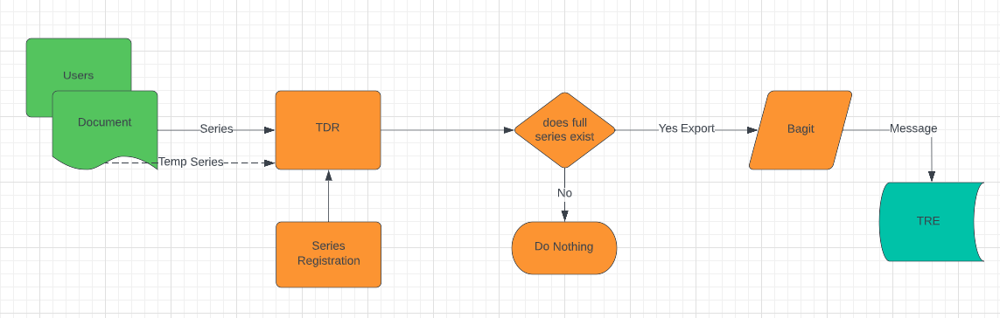

# 26. Temporary Series Workflow 

**Date:** 2022-07-05

## Context

TDR application will support the creation of a temporary series by the user.
Until a full series is defined for a consignment it cannot progress through to the preservation systems.
Should TDR release the export with a temporary series and let downstream systems deal with it or should TDR take control.

## Decision

To help support the preservation process it was decided that TDR would not export the BagIT package until a permanent Series was added to the TDR database.
At which point TDR would export the BagIT and notify downstream systems in the usual manner.

The advantages of doing this are:
* The user can still upload and deliver through TDR without the need of a full series being assigned
* It does not cause issues or effect any downstream processes.

This does mean that TDR is dependant on the Cataloguing team for a quick turn around for series assignment

