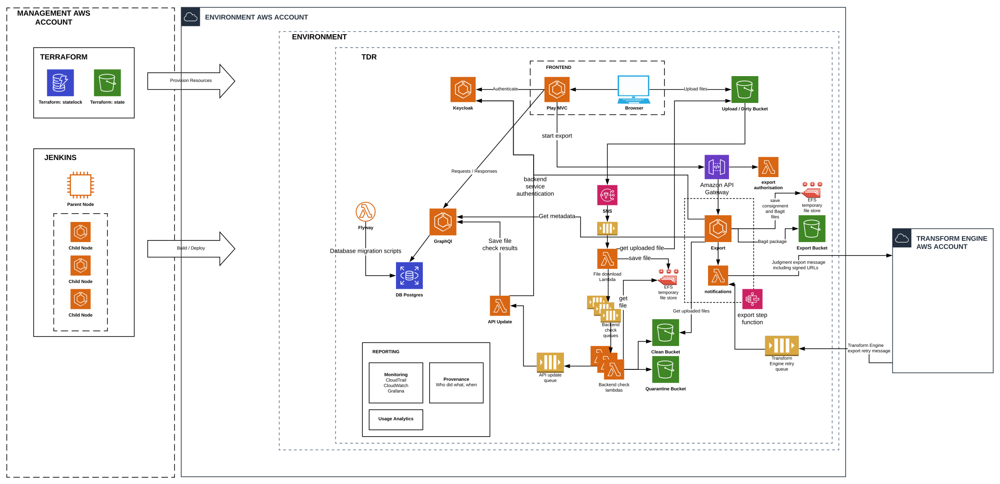

# Beta Architecture

## Initial Design

The initial architectural design for beta is shown below.

Diagram is available for editing here: https://www.lucidchart.com/documents/edit/caa0eee6-a9ef-4d2e-a03e-4a1d6fc7b7e4/0_0

This is not the final architecture, and it will change during the course of the beta phase of the TDR project.

#### AWS Accounts

AWS accounts will be set up for each environment that will be used.

#### Environments

Multiple environments will be used:
* Continuous Integration (CI)
* Test
* Production

#### TDR

The application stack will run within the defined environments. 

### Assumptions

[TODO]

### Open Questions

* Is the browser going to access the API or should it use the Play MVC frontend?
* What is the purge queue strategy?
* Should the backend checks run in containers (using batches) or just use lambda functions for each file?
* Should the GraphQL update the DB directly?
* What auditing is required?
* Whether to make use of AWS SNS topics
