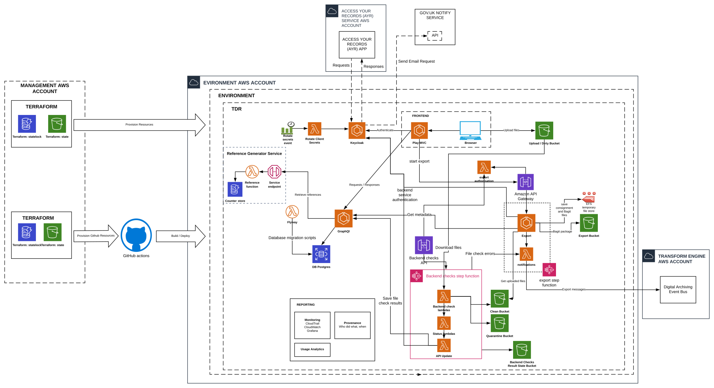

# Beta Architecture

The current architectural design for beta is shown below.

Diagram is available for editing here: https://www.lucidchart.com/documents/edit/caa0eee6-a9ef-4d2e-a03e-4a1d6fc7b7e4/0_0

This is not the final architecture, and it will change during the course of the beta phase of the TDR project.

## AWS Accounts and TDR environments

TDR uses five AWS accounts:

* Management (mgmt): the top-level account, which is used for running
  cross-environment services like Jenkins CI and Grafana.
* Sandbox (sbox): used for technical spikes
* Integration (intg): the first environment that code is deployed to. Most
  services are deployed automatically to intg when code is merged to the
  main/master branch. Most deployments are run programatically through Jenkins,
  but we sometimes make temporary manual changes or deploy a branch when that's
  the easiest way to test something.
* Staging (staging): a more stable environment used to check changes just before
  deployment to production. Developers need to manually start a Jenkins job to
  deploy code to this environment. Used for user research sessions.
* Production (prod): the environment used by real users. Deployment is the same
  as for staging.

This diagram shows the interactions between the different AWS accounts:

### TDR

The applications which make up TDR run within each environments. For example,
each environment has a frontend application, API, auth server, etc.

## Upload and Transfer Sequence

This diagram shows a high level view of the interactions between the different AWS services during the upload and transfer of files:

## Transform Engine Service

As part of the Find Case law service TDR accepts judgment transfers.

TDR communicates with the Transfer Engine service to support the Find Case law service.

The Transfer Engine service sits within a different AWS account. To allow communication between the two accounts, relevant IAM roles are given permission to access the AWS resources across the accounts.

### Communication Between TDR and Transform Engine

* Upon export of a judgment transfer TDR send a message to an SQS queue belonging to the Transform Engine with details of the transfer allowing the Transform Engine to process the judgment.
* If the Transform Engine requires a retry of any transfer, it sends a message to a TDR SQS queue that triggers a new notification to be sent back from TDR to the Transform Engine SQS queue.
  * Note: the retry message from the Transform Engine does not trigger a re-export of the transfer.
  
It is likely in the future that this functionality will be expanded to include all transfers from TDR, and not just judgment transfers.

#### Transform Engine Version 2 Architecture

Transform Engine is changing the way it communicates with external systems.

See details of this here:
* [TRE version 2 Architecture](https://github.com/nationalarchives/da-transform-dev-documentation/blob/master/architecture-decision-records/002-New-messaging-architecture.md)
* [TDR to TRE Integration](https://github.com/nationalarchives/da-transform-dev-documentation/blob/master/architecture-decision-records/003-New-TDR-TRE-integration.md)

TDR will support this new architecture, in parallel with the original, until TRE fully migrates to version 2.

Once the migration from the original architecture to the new architecture is complete, the TDR resources used to support the original architecture will be removed.

### Initial assumptions

* We don't yet need to integrate TDR with any other systems, though we might
  reuse the login system to let department users view their own records
* Series and departments won't need to be updated very often, so for MVP it's OK
  for this to be a developer task, even though eventually we might build an
  admin UI or integrate with the planned catalogue API
* Data stored in the export bucket can be transferred to the preservation system
