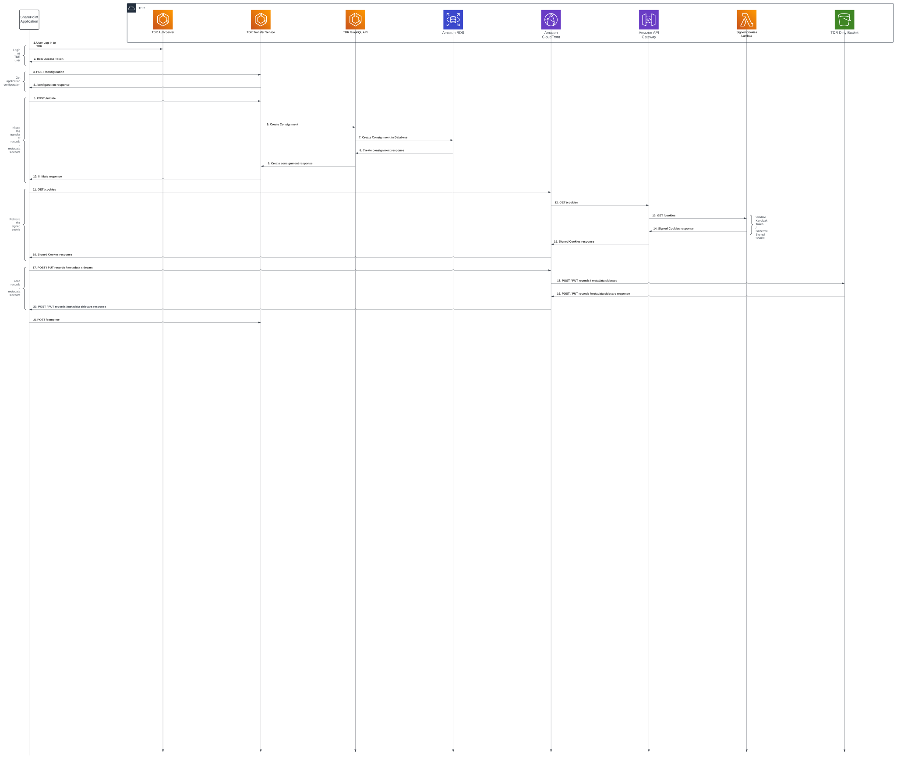

# Beta Architecture

The current architectural design for beta is shown below.

Diagram is available for editing here: https://www.lucidchart.com/documents/edit/caa0eee6-a9ef-4d2e-a03e-4a1d6fc7b7e4/0_0

This is not the final architecture, and it will change during the course of the beta phase of the TDR project.

## AWS Accounts and TDR environments

TDR uses five AWS accounts:

* Management (mgmt): the top-level account, which is used for running
  cross-environment services like central logging, Terraform state tracking, ECR and Grafana.
* Sandbox (sbox): used for technical spikes
* Integration (intg): the first environment that code is deployed to. Most
  services are deployed automatically to intg when code is merged to the
  main/master branch. Most deployments are run programatically through Github actions,
  but we sometimes make temporary manual changes or deploy a branch when that's
  the easiest way to test something.
* Staging (staging): a more stable environment used to check changes just before
  deployment to production. Developers need to manually start a Githud action to
  deploy code to this environment. Used for user research sessions and demonstrations to key stakeholders.
* Production (prod): the environment used by real users. Deployment is the same
  as for staging.

This diagram shows the interactions between the different AWS accounts:

### TDR

The applications which make up TDR run within each environments. For example,
each environment has a frontend application, API, auth server, etc.

## Upload and Transfer Sequence

This diagram shows a high level view of the interactions between the different AWS services during the upload and transfer of files:

## Digital Archiving Event Bus

TDR communicates with other Digital Archiving services using the Digital Archiving event bus hosted in the Transform Engine AWS accounts.

TDR sends export messages to the event bus for other services to consume.

## Access Your Records (AYR) Service Integration

The Access Your Records (AYR) service shares the same user base as TDR.

AYR uses the TDR Keycloak instance to manage its users and provide authentication and authorisaion for AYR's functionality.

AYR makes use of Keycloak's provided APIs.

## Reference Generator Service

The reference generator is a standalone service for generating unique 'references' for files and folders. The current architecture for the reference generator service:

The service consist of 3 main components
* API Gateway: Provides access to the service from other AWS services and external clients outside of AWS. 
* Lambda: the Lambda generates the "references" based on an incremented counter;
* DynamoDb: the table contains the counter to generate the unique "references";

For more details on the service refer to here: 
* [Reference Generator Service](https://github.com/nationalarchives/da-reference-generator)

TNA will be changing where we assign citeable references for individual born-digital records 
This is currently done by our Digital Preservation Service. Following this change it will be done by our Digital Selection and Transfer Service.
At the moment, TDR generates a system reference (UUID) which is not readily citeable and does not persist into the preservation system or Discovery.
The reference generator service will be used to assign citeable references.

## Initial assumptions (historic)

* We don't yet need to integrate TDR with any other systems, though we might
  reuse the login system to let department users view their own records
* Series and departments won't need to be updated very often, so for MVP it's OK
  for this to be a developer task, even though eventually we might build an
  admin UI or integrate with the planned catalogue API
* Data stored in the export bucket can be transferred to the preservation system

## Metadata Validation
TDR validates metadata.csv files, ensuring integrity of the file and data within. Once validated the consignment status is updated and validation report saved to S3. The status and report can be used to drive the UI.  
This diagram show the backend flow of data during validation and saving

## SharePoint to TDR Transfers
TDR supports transfers directly from SharePoint via an application on SharePoint. This application communicates with TDR using a set of API endpoints hosted on an ECS task.
The SharePoint application utilises the same transfer method to TDR's dirty bucket as the TDR application itself.
This diagram present this sequence of calls and the interactions with TDR's services and AWS infrastructure.

## External Event Handling
The External Event Handler allows TDR to receive events from external systems such as Digital Records Repository (DR2) and act upon them accordingly.
Events are received into a dedicated SQS queue which in turn triggers the event handling lambda.
This diagram shows an overview of the event handling process as initially designed.

