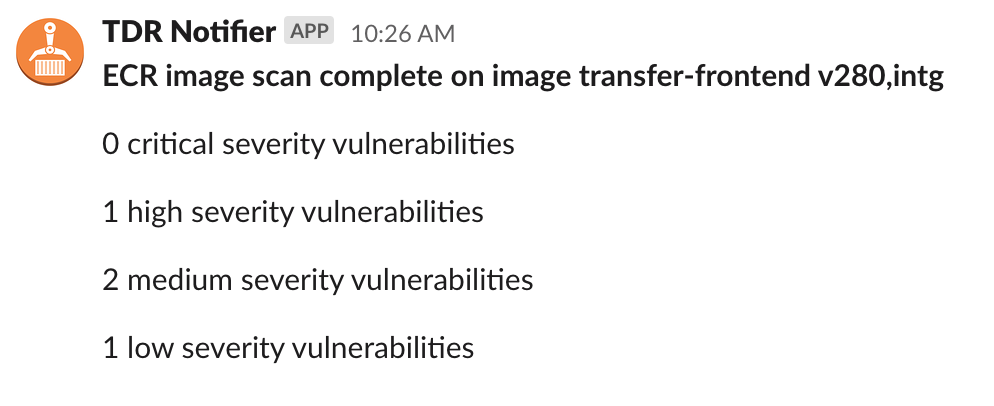
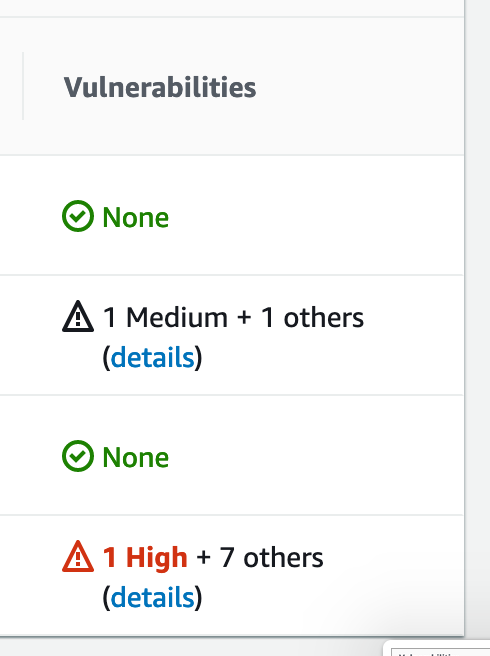
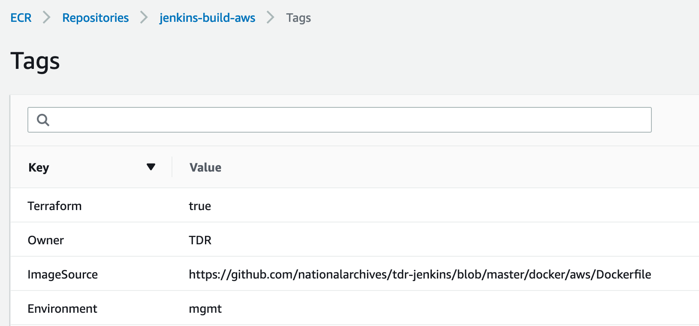

# ECR scan alerts

TDR uses Docker containers to run services in [AWS ECS] and to build and test
services in [Jenkins]. Docker containers are stored in [ECR] repositories. These
repos have [image scanning] enabled. This means that if an image with a known
vulnerability is pushed to ECR, an alert is sent to the TDR Slack channel and
the tdr-secops email address. A scan is also run [periodically][periodic-ecr] to
check for vulnerabilities in current images (i.e. those tagged with "latest" or
a TDR environment tag).

An alert looks like this:

[AWS ECS]: https://aws.amazon.com/ecs/
[Jenkins]: https://github.com/nationalarchives/tdr-jenkins
[ECR]: https://aws.amazon.com/ecr/
[image scanning]: https://docs.aws.amazon.com/AmazonECR/latest/userguide/image-scanning.html
[periodic-ecr]: https://github.com/nationalarchives/tdr-terraform-backend/blob/60d7b655b7b7436ee5c0ef317bf36e04d30d5d3a/root.tf#L338

## Fixing alerts

Open the AWS Console for the TDR management account, go to the ECR service and
find the repostitory. Open the vulnerability details for the relevant image tag:

Each vulnerability will link to a Common Vulnerabilities and Exposures (CVE)
report, which includes details of the component with the vulnerability, which
versions are affected, and whether a fix is available.

To fix the vulnerability, you will need to rebuild the image and potentially
update the Dockerfile. To find the Dockerfile that the image was built from,
check the ECR repository's tags, and look for the one named `ImageSource`:

The base Docker image may already include this fix, so it's worth rebuilding and
redeploying the image to see if it fixes the alert:

* To rebuild a TDR service image, run the build for the master branch of that
  service's repository, e.g. [TDR Transfer Front End Test/master]
* To rebuild the Jenkins Docker image, or one of the build node images, follow
  the [Jenkins deployment] instructions using the [TDR Build Jenkins Node Images] Jenkins job 

Check ECR again once the new image has been pushed. Scan results appear within a
few seconds.

If you want to check the results of a scan without triggering more Slack and
email alerts, create a [temporary ECR repo in the Sandbox account][sandbox-ecr],
and push the images to that repo first, using the [TDR Build Jenkins Node Images] Jenkins job

If the scan still reports the vulnerability, follow the instructions in the CVE
report to fix it. A common fix is to upgrade the affected package, for example
by adding a command like `apk upgrade name-of-package` for images which are
based on Alpine Linux.

[TDR Transfer Front End Test/master]: https://jenkins.tdr-management.nationalarchives.gov.uk/job/TDR%20Transfer%20Front%20End%20Test/job/master/
[Jenkins deployment]: https://github.com/nationalarchives/tdr-jenkins#deployment
[TDR Build Jenkins Node Images]: https://jenkins-prod.tdr-management.nationalarchives.gov.uk/job/TDR%20Build%20Jenkins%20Node%20Images/
[sandbox-ecr]: https://github.com/nationalarchives/tdr-scripts/tree/master/terraform/ecr-sandbox
