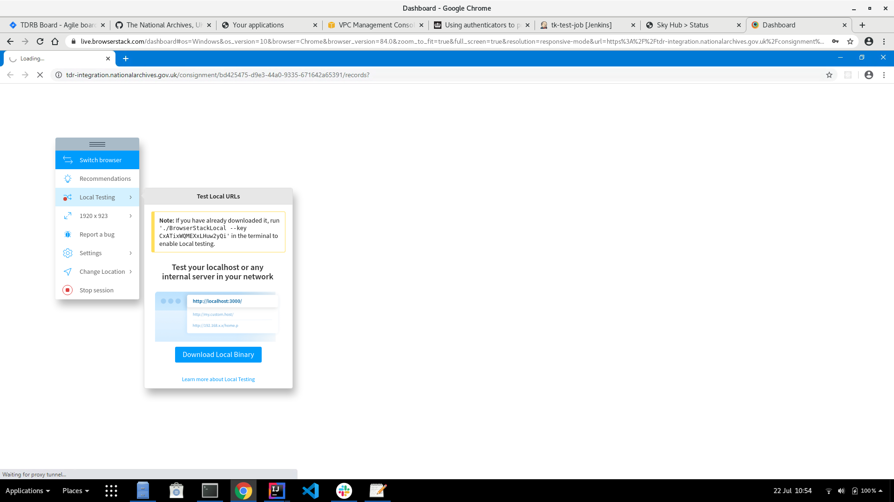

# BrowserStack Testing

## Testing locally running or TDR integration environment

BrowserStack local testing allows the testing of non-public applications

Documentation on local testing using BrowserStack is available here: https://www.browserstack.com/local-testing

To test the TDR application that is either running locally, or on the TDR integration environment:
1. Initially check that can login into the TDR application from local machine;
2. Download BrowserStack local binary
3. Start BrowserStack local binary: `[directory of local binary] $ ./BrowserStack --key=[account key] --force-local`
  * `--force-local` flag: Routes all traffic via machine where BrowserStackLocal Binary is running. Needed to provide access to the TDR login page. 
4. Begin BrowserStack testing through the local binary. 
  * The testing session should automatically start in local mode if the binary is already started.
  * If the testing session does not start in local mode, change the session to local mode using the session manager dialog box:
  
  
