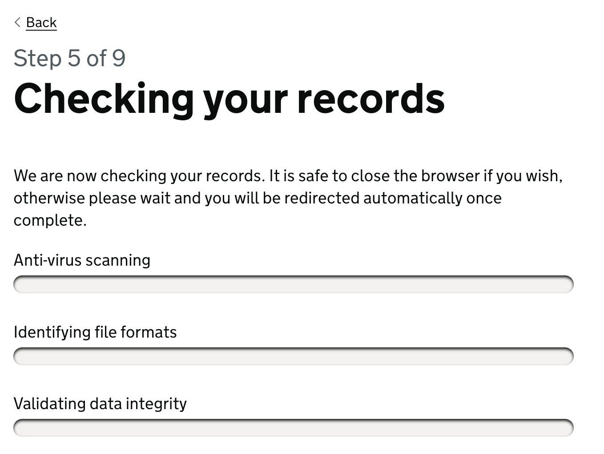
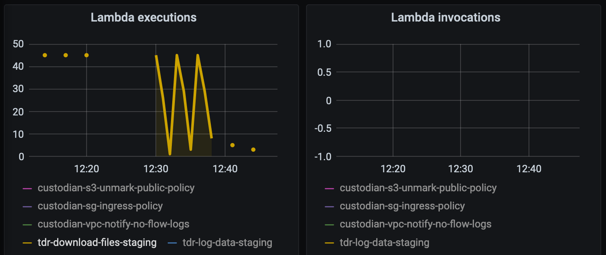

# Debug failing file checks

Symptoms: the file check progress get stuck on 0%:



Or the end-to-end tests fail at the point where the user should be redirected to
the file checks result page.

## What to check

Look at the Grafana file check dashboards:

* Integration: https://grafana.tdr-management.nationalarchives.gov.uk/d/LdDrATKGk/file-checks-integration
* Staging: https://grafana.tdr-management.nationalarchives.gov.uk/d/G48U1YoGk/file-checks-staging

These will show you if messages are being published to the SNS topic and SQS
queues, and which lambdas are running. It will also show you how many messages
have been sent to the dead letter queue.

Check the Cloudwatch log groups for the file check lambdas.

Check the dead letter queue, named "tdr-backend-check-failure-<env>". Click
"Send and receive messages", then poll for new messages and inspect the recent
ones.

## EFS connection errors

There is a known issue with the file check lambdas, where they fail to connect
to the EFS store on startup. This seems to happen when we make Terraform changes
to the Lambda security groups, subnets and EFS configuration. As far as we can
tell, it's a bug in Lambda or EFS.

### Diagnosis

To check if this is the issue, look at the Grafana file check dashboards or the
Lambda monitoring graphs in the AWS console. When you upload files through the
frontend, they will show up in the Lambda **executions** but not the Lambda
**invocations**:



Lambda will not report this as an error, and nothing appears in the CloudWatch
logs, but the message that triggered the lamba will eventually be sent to the
failure queue.

### Fix

To fix the issue, recreate and redeploy the affected Lambda function(s):

* In tdr-terraform-environments, [taint] the affected Lambda using the terraform
  resource path for the Lambda. For example, to taint the download files Lambda:

  ```
  terraform taint 'module.download_files_lambda.aws_lambda_function.download_files_lambda_function[0]'
  ```
* Run the [Jenkins Terraform Environments Deploy][tf-deploy] against the
  relevant environment to destroy and recreate the tainted Lambda
* Run the relevant Jenkins deploy job to redeploy the code for the Lambda

You may have to repeat this for all the file check lambdas if several of them
are not running.

[taint]: https://www.terraform.io/docs/commands/taint.html
[tf-deploy]: https://jenkins.tdr-management.nationalarchives.gov.uk/job/TerraformEnvironmentsDeploy/
