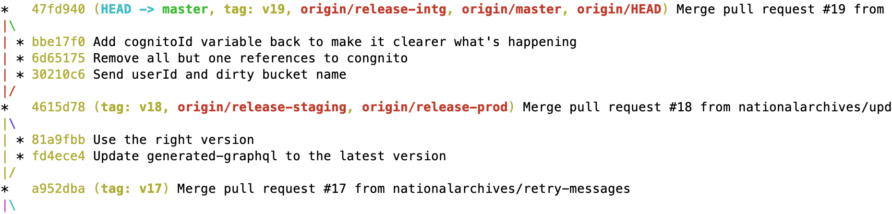

# Deploy code to Production

Transfer Digital Records uses the practice of [Continuous Integration]: developers merge their work into a repo's main
branch regularly. The repo is configured to only allow changes to be merged if the checks pass, such as unit tests, code
linters and security checks. These checks are currently run on a [Jenkins instance][tdr-jenkins-intg].

We also perform [Continuous Delivery]. The main branch of any repo is always deployable, and can be deployed to
Production multiple times a day if necessary. The [end-to-end tests] which run on Integration and Staging help us catch
regression issues before code is deployed to Production. Deploying frequent changes to Production means that each
deployment is small, which makes deployments less risky and easier to fix.

TDR is made up of [multiple services][tdr-architecture], each of which are deployed separately. Infrastructure is also
defined in Terraform repos, and is deployed to each environment in the same way.

## When to deploy

You should deploy to Staging and Production as soon as possible after merging the change and checking it on Integration.
This means that you can deploy your own change. If you leave your change undeployed and someone else deploys it at the
same time as theirs, and there are failures, it will be harder for them to debug.

We have agreed to some rules about when it is OK to deploy to Production:

- Only when you have time to monitor the deployment. Decide how long you need based on the size and complexity of the
  change.
- Only when there are other TDR developers around. We are a small team with flexible working hours, so there are no
  restrictions based on the time of day, but you should make sure that at least one other developer is around to help
  debug any deployment issues.
- Not on a Friday or the day before a bank holiday. Ideally, we would also deploy on Fridays to avoid a build-up of
  changes that would make the deployment larger, but we need to demonstrate that our deployments are low-risk and that
  we can catch issues early with tests and monitoring.
- If the end-to-end tests passed on Staging after the most recent deployment

These rules only apply to Production, but it's usually better to apply them to Staging as well. This means that you can
deploy to Production shortly after deploying to Staging, which prevents coordination problems where changes are deployed
to Production in the wrong order.

## How to deploy a change to Production

The developer who made a change is responsible for the deployment. If you do not have permission to deploy to Staging
and Production, you should ask a developer with Production access to run the actual deployments, but you yourself should
still follow the steps below to make sure everything is working at each step.

This guide explains how to deploy a single service. If you need to deploy multiple changes (e.g. a database, API and
frontend change), you should follow these steps separately for each service. Each step needs to be compatible with the
other services currently deployed to each environment. For example, you should not deploy an API change which depends on
a database change that hasn't been deployed yet. The end-to-end tests should help you catch problems like this so that
you can roll out the change without any downtime.

**Always deploy to each environment in order.** Deployment to Integration should be first, followed by Staging, and
finally Production.

### Step 1: Merge your branch

This assumes that you have created a pull request for your changes in GitHub, and it has been approved by a reviewer.
TDR repos are set up so that you can only merge a branch once it has been approved and the CI checks have succeeded (see
the [repo setup guide]).

### Step 2: Deploy to Integration

Most repos, including the main codebases like the frontend and consignment API, are deployed to Integration
automatically after the main branch build has finished. If you are unsure, check the Jenkinsfile in the repo.

Some repos, like the [database migrations], have a Jenkins deployment job that needs to be started manually. Check the
repo's Readme for instructions.

Before moving on to the next step, wait for the deployment to finish. Some deployments, such as changes to Lambda code
and database migrations, happen immediately. So if the Jenkins job succeeded, then the change has been deployed.

[ECS] deployments, such the frontend, consignment API and auth server, take a few minutes longer while the load balancer
switches over to the new container. To check the progress of a deployment, open the [Grafana ECS dashboard] and look at
the number of tasks running in Integration. When a deployment starts, the number of tasks jumps up from 1 to 2. When it
has finished, it falls back down to 1. For example, this graph shows a Keycloak deployment followed by a frontend
deployment:


Alternatively, you can open the ECS service in the AWS console and check the Events tab. You should see logs when ECS
starts a new task and stops the old one.

### Step 3: Check the deployment on Integration

Before deploying to Staging and Production, make sure that you're happy with the change on Integration. For most
deployments, this means waiting for the [end-to-end tests][e2e-tests-intg] to run. You should also try out the change
yourself on Integration.

You should check for any alerts posted to the [da-tdr-releases Slack channel][[release Slack channel]] that might
indicate problems with the deployment. You could also check relevant [Grafana] graphs or CloudWatch logs to look for
anything that's different to normal.

You should not need to run manual regression tests. If you feel like you need to do that to be confident in the change,
consider adding more automated tests that would check those things.

Some changes may need to run for some time before we're confident that they work OK. This might be the case for file
check changes that could affect the performance, or which might cause intermittent errors. In this case, warn the rest
of the team that they should not deploy this repo to Staging and Production yet. Try to keep the testing time short
(e.g. a day or two at most), so that it doesn't block the rest of the team.

We should not have to hold off Production deployments because of user testing. If a feature needs to be tested by users
before it is available on Production, then it should be put behind a [feature toggle] so that the deployment and the
feature release are independent.

### Step 4: Check what will be deployed to Staging and Production

Every main branch build is tagged with a version number. When we deploy to an AWS environment, the deployment job
updates the relevant release branch so that it matches the deployed version. See the [architecture decision record on
versioning][adr-2] for more details on how this works.

Inspect the git history to check the currently deployed versions. For example, if you fetch the latest version and run
`git log --graph --pretty=oneline --abbrev-commit`, you should see something like this:



This shows that v19 is currently deployed to Integration, and v18 is deployed to Staging and Production.

You can find all the commits (excluding trivial commits like PR merges) between two release branches by running the
command:

```
git log --pretty=format:"%h%x09%<(20)%an%ad%x09%s" origin/release-Staging..origin/release-intg | grep -v "Merge branch" | grep -v "Merge pull request"
```

If there are commits by anyone else, **ask them** before running any further deployments in case there is a good reason
not to deploy their code to Staging and Production.

Make a note of the version that contains the commits you want to deploy.

### Step 5: Deploy to Staging

Go to the [Production Jenkins instance][tdr-jenkins-prod] and find the deployment job for the relevant repo.

Click 'Build with parameters', and set the `STAGE` parameter to `Staging` and the `TO_DEPLOY` parameter to the version
you found in the last step.

### Step 6: Check the deployment on Staging

As for step 3, wait for the [end-to-end tests][e2e-tests-Staging] to succeed, and check you're happy with the change on
Staging. Again, look out for alerts in the [release Slack channel], and check any relevant graphs or logs.

### Step 7: Deploy to Production

You should deploy to Production as soon as possible after deploying to Staging. If the environments are in sync, it
makes it easier to roll out other changes and be confident that everything works. If you delay the Production
deployment, a later deployment might succeed on Staging but fail on Production because it was dependent on your change,
which hadn't been deployed yet.

Run the same deployment job that you ran to deploy to Staging, but set the `STAGE` parameter to `Production`.

### Step 8: Check the deployment on Production

Production does not have end-to-end tests, and we don't normally log into Production ourselves to avoid generating test
consignments in Production. There are more monitoring alerts set up on Production, such as [file check failures], [load
balancer errors] and Status Cake availability monitoring alerts. Investigate any that happen after your Production
deployment.

## Production outages

If there is a severe issue on Production that you can't fix immediately, either because it's hard to find the cause or
because you are the only person available, you should deploy the [service unavailable page].

[Continuous Integration]: https://martinfowler.com/articles/continuousIntegration.html
[tdr-jenkins-intg]: https://jenkins.tdr-management.nationalarchives.gov.uk/
[tdr-jenkins-prod]: https://jenkins-prod.tdr-management.nationalarchives.gov.uk/
[Continuous Delivery]: https://martinfowler.com/bliki/ContinuousDelivery.html
[end-to-end tests]: https://github.com/nationalarchives/tdr-e2e-tests
[tdr-architecture]: ../../beta-architecture/beta-architecture.md
[repo setup guide]: ../create-repo.md
[database migrations]: https://github.com/nationalarchives/tdr-consignment-api-data/
[ECS]: https://aws.amazon.com/ecs/
[Grafana ECS dashboard]: https://grafana.tdr-management.nationalarchives.gov.uk/d/VqAOpRFGk/ecs-running-tasks
[e2e-tests-intg]: https://jenkins.tdr-management.nationalarchives.gov.uk/job/TDRAcceptanceTest/
[e2e-tests-staging]: https://jenkins-prod.tdr-management.nationalarchives.gov.uk/job/TDRAcceptanceTest/
[Grafana]: https://grafana.tdr-management.nationalarchives.gov.uk/
[feature toggle]: https://martinfowler.com/articles/feature-toggles.html
[adr-2]: ../../architecture-decision-records/0002-versioning-and-deployments.md
[release Slack channel]: https://tna-digital.slack.com/messages/da-tdr-releases/
[file check failures]: https://grafana.tdr-management.nationalarchives.gov.uk/d/Wza7CyCGk/production-file-check-failures
[load balancer errors]: https://grafana.tdr-management.nationalarchives.gov.uk/d/xFDTXYCGz/production-load-balancer-errors
[service unavailable page]: ../deploy-the-service-unavailable-page.md
