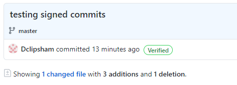

# Configure Signed Commits

[Signed Commits](https://docs.github.com/en/github/authenticating-to-github/managing-commit-signature-verification/signing-commits) are used to help to protect against supply chain & impersonation attacks by ensuring Git commits are verified as genuine through the use of GPG keys.

An alternative setup guide is [here](https://withblue.ink/2020/05/17/how-and-why-to-sign-git-commits.html).

## Local Configuration
1. Install a GPG Client:

   A GPG Client needs to be installed on your development machine.

    * For Windows, this can be [GPG4Win](https://www.gpg4win.org/).
    * For macOS, Use [Homebrew](https://brew.sh/): `brew install gpg`.
    * For Linux, you probably have GPG installed out of the box, but if not GPG packages should be easily obtainable via your package manager of choice.

    a. If you are using a Mac, depending on what shell you use, you'd need to open on of these files add this command `export GPG_TTY=$(tty)` to the end and save:
    * Bash: ~/.bash_profile or ~/.bashrc
    * Z shell: ~/.zshrc
    * Fish: ~/.config/fish/config.fish

2. Generate a key via the command line terminal by running `gpg --full-generate-key`

3. You will be asked for the type of key you want to use:

    * type: `4` and press enter to select the option (4) RSA (sign only)`

4. Next it will ask for keysize
    * type: `4096` and press enter

5. It will then ask you how long you want this key to be valid for
    * You can start with `2y` for 2 years, or a longer/shorter period if you'd prefer; it can be renewed or revoked as required.
    * After pressing enter, it will ask you to confirm, type `y` or `N` (it's case-sensitive)

6. You'll also be asked for your (after each, you'd press enter):
    * full name
    * email address (use the "Primary" address associated with your [GitHub account](https://github.com/settings/emails)). It must match the git config email, you can verify this by running `git config --global user.email`
    * comment (this could be left blank)
    * confirmation `Change (N)ame, (C)omment, (E)mail or (O)kay/(Q)uit?`
        * enter a letter (uppercased) to choose an option
    * passphrase (which you will need whenever you commit unless using GPG tools that store your passphrase; so keep it safe.)
        * If you don't enter a passphrase quickly enough, it will timeout, and you'll have to start again from step 2

7. You'll need your KeyID, which you can get this keyID through the command: `gpg --list-secret-keys --keyid-format=long`. Depending on what you see in the output, the KeyID is either:
    * the 'xxxxxxxx' (hexadecimal pattern) part of the `rsa4096/xxxxxxxx` key
    * or the 'XXXXXXXXXXXXXXXXXXXXXXXXXXXXXXXXXXXXXXXX' (hexadecimal pattern) from this output
      `sec rsa4096 {date} [SC] [expires: {date}]`

      `XXXXXXXXXXXXXXXXXXXXXXXXXXXXXXXXXXXXXXXX`

8. Configure your own git client to use the key: `git config --global user.signingkey <keyID>`

9. You can configure Git to sign all of your commits automatically: `git config --global commit.gpgsign true`

    * Otherwise, whenever you commit you need to use the -S flag, e.g.: `git commit -S -m "commit message"`

10. run `export GPG_TTY=$(tty)` (remove the `$` if you are using Fish shell)

11. On Windows run 
    `git config --global gpg.program "C:\Program Files (x86)\GnuPG\bin\gpg.exe"`

## GitHub Configuration
1. You'll need the PGP block for your key, which you can obtain through: `gpg --armor --export <keyID>`

2. Next, log on to GitHub via the website, then go to your account settings > SSH and GPG Keys > New GPG key.

3. Copy and paste in the PGP block (including the `-----BEGIN PGP PUBLIC KEY BLOCK-----` & `-----END PGP PUBLIC KEY BLOCK-----` parts)
    * click 'save'

## Testing Configuration
* You can test that you've been successful by making a commit (remember to use the -S flag if you haven't configured your Git client to sign all commits) and pushing it to a repo (it can be a personal repo if you wish).
* You should see a 'verified' label through the GitHub web interface for your push.
  

## Troubleshooting

1. If after committing and pushing to GitHub, you notice that your commits are still not verified, try running `git config commit.gpgsign` in the repo from which you are making the commit.
   * Since this command is missing the `--global`, you'd have to run it in all the repos you'd like signed commits applied to.
2. If after committing and pushing to GitHub, you notice that your commits are labelled as "Unverified", check if the email address that you've configured locally is the same as the one labelled as "Primary" on [Github](https://github.com/settings/emails).
   * To see the email address that you configured locally run this command `$ git config --global user.email`
3. If you would like to disable GPG signing:
   * for all repositories, run this command `git config --global commit.gpgsign false`
   * for a single repository, run this command `git config commit.gpgsign false`

## Undoing/Starting again

If something has gone wrong, and you would like to start again with the set up, run these commands:
* `git config --global --unset user.signingkey`
* `gpg --delete-secret-keys <keyID>`
  * it will ask you twice if you'd like to delete, just enter `y` each time.
