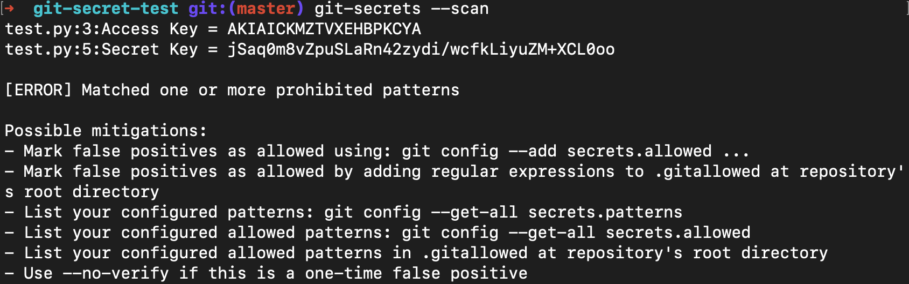

#git-secrets

[git-secrets](https://github.com/awslabs/git-secrets) is used to prevent passwords/AWS keys/IDs etc from being committed to a git repository and compromising security.

##Installation
git-secrets must be placed in PATH so that git picks it up when running git-secrets commands.
Your PATH is an environment variable that holds directories/folders with programs that can be executed within the command line.
Usually each of these has their own defined behaviours and execution settings. PATH is sometimes referred to as `bin`.

####MacOS
Use [Homebrew](https://brew.sh/) to install with the command `brew install git-secrets`. Once installed, quit the terminal application and then re-open.
Homebrew downloads sometimes take a while, especially if you have not used Homebrew in a while as it will update Homebrew first.
####Linux
Clone the git-secrets [repository](https://github.com/awslabs/git-secrets) to your preferred location, then cd into the main directory for the git-secrets repository you have cloned.
Run `sudo make install`.
This should place git-secrets into your PATH, but if not you may need to move it and run `sudo make install` again OR include the folder made by running `sudo make install` into your PATH.

Once installed, you can use `git-secrets` or `git secrets` interchangeably within the command line

##Initialising git-secrets on all local repositories
* Run `git-secrets --install ~/.git-templates/git-secrets`
* Then run `git config --global init.templateDir ~/.git-templates/git-secrets`

To initialise git-secrets for a specific git repository, `cd` into said repository. Run `git-secrets --install`. This step may not be required if you have initialised git-secrets on all local repositories in the past.

##Add settings to check for AWS keys
As git-secrets was made by AWS, it includes a build in method to detect AWS keys. To initialise this, run `git-secrets --register-aws --global`.
The `--global` part sets the AWS pattern search to all repositories covered by git-secrets.
With this built in command, git-secrets will search for common AWS patterns like: 
* AWS Access Key IDs
* AWS secret key assignments
* AWS account ID assignments
* known credentials from your `~/.aws/credentials` file (if you have one).

##Test git-secrets implementation

Clone the [git-secrets-test](https://github.com/trenchesofit/git-secret-test) to your prefered location and `cd` into the main directory for the `git-secrets-test` project.
Run `git-secrets --scan`. This should result in an output similar to below:

You can also test by attempting to commit the same directory, you should see a similar output to that above:

If you do not see these errors (or something similar), git-secrets may not be installed properly on that specific directory, or the patterns you have set up to look for do not appear (though they should for this repo in particular).
Try to run `git-secrets --install` in case it has not been initialised for that repo in particular.

##Config
To list all configurations run `git-secrets --list` or `git config --get-all secrets.patterns`.
The latter can be used to view only prohibited patterns.
If you don't see a pattern you wish to be scanned for run `git-secrets --add`. You can then add a prohibited or allowed pattern that you want git-secrets to look for.
The patterns are defined using [regex](https://regexr.com/) to search for patterns in text being committed.