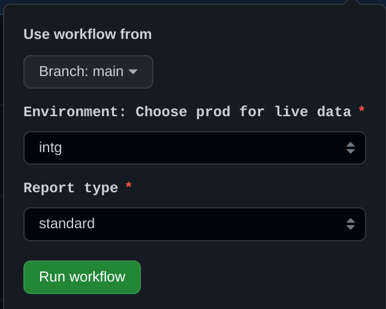

# TDR Reporting

These are instructions for running the reports TDR provide via our GitHub action.

## Requesting access for a new user
You will need a GitHub account. If you don't already have one, [you can create one](https://github.com/signup). You will need to add two-factor authentication to your account. GitHub have [a guide to setting this up](https://docs.github.com/en/authentication/securing-your-account-with-two-factor-authentication-2fa/configuring-two-factor-authentication)

If you are already a member of the `nationalarchives` GitHub organisation then you will already have access.

If not, ask the TDR team to add you to the `tdr-reporting` repository as a collaborator. You can contact us [on our Slack channel](https://tna-digital.slack.com/archives/CJYJYG54L) Once this is done, we will let you know.

## Run the reports
Go to the [tdr-reporting actions page](https://github.com/nationalarchives/tdr-reporting/actions/workflows/run.yml). You will see a page similar to this

 
Click "Run workflow" which will give you options like this:

You can ignore the first dropdown with Branch: main in it. The other three can be configured:

### Environment
This determines which of the three TDR environments the report runs against and has three options:
#### Prod 
This will give you live data. 

#### Staging
This is one of our test systems. It contains less data than Intg.

#### Intg
This is used for most of our testing and has a large amount of test data in it.

### Report Type
#### Standard
This is a detailed report containing all TDR consignments and includes the transferring body code, export date time and a file count.

#### CaseLaw
This report has fewer details than the standard report and only shows judgment transfers.

### Emails
The job will send the report through to Slack so this needs to be the email address associated with your TNA slack account. You can add more than one email address for multiple recipients but each needs to be enclosed in double quotes and separated by a comma. For example:
* "user1@nationalarchives.gov.uk"
* "user1@nationalarchives.gov.uk","user2@nationalarchives.gov.uk"

The report will run and when it has finished, you should get a message from a Slack bot with a CSV file with your requested report.
