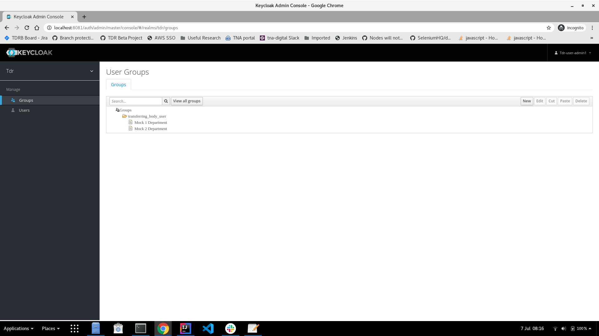
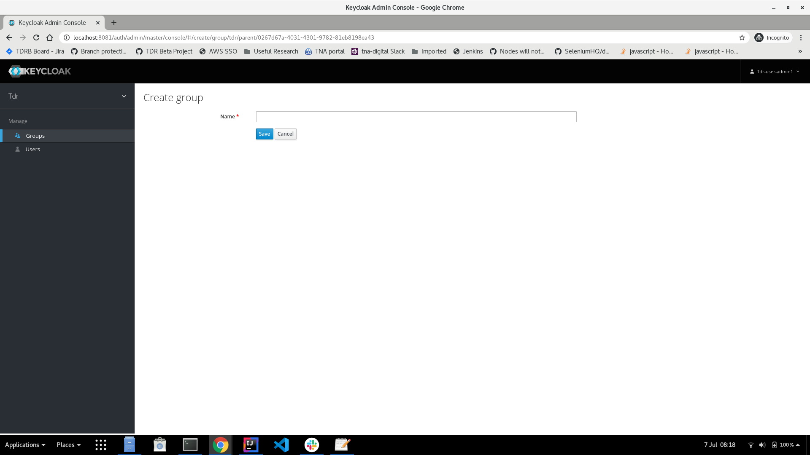
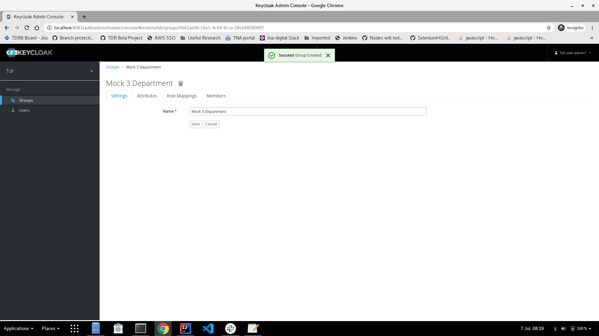
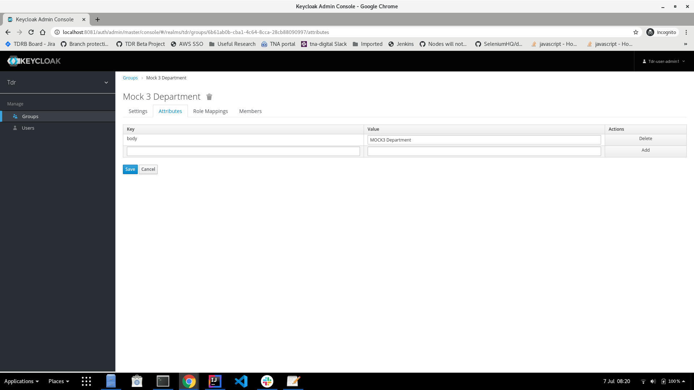
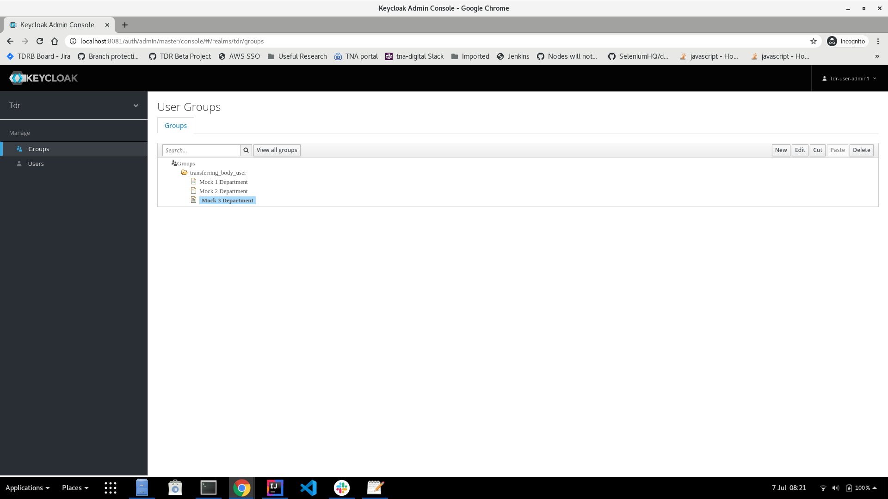
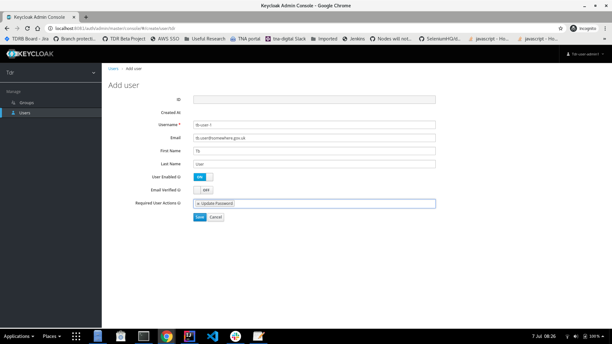
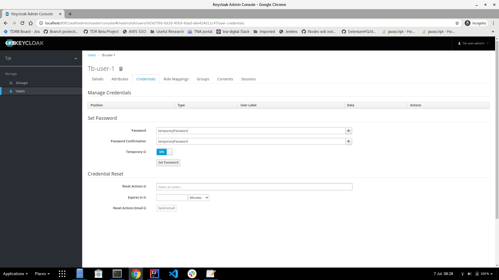

# TDR User Administrator Manual

## Role Description

TDR user administrators have rights and privileges to manage:

1. Transferring body users of the TDR application
  * Create
  * Delete
  * Edit
  * Assign to transferring bodies
2. Transferring body groups:
  * Add
  * Remove
  * Edit

## Setting Up As TDR User Administrator

1. Contact TDR team to request being set up as a TDR user administrator: ?email address?
2. You will receive add email from the TDR team with:
  * your user name 
  * a temporary password
  * Url to the Keycloak application
3. Ensure you have either Microsoft Authenticator, or Google Authenticator available as you will need these to log on to the Keycloak application
3. Log on to the Keycloak application for the first time:
  * Go to the provided URL
  * You will be prompted to set scan a QR code with an authenticator application to set up MFA for Keycloak
  * You will be prompted to reset your password
  
## Managing Transferring Body Users

### Adding a new transferring body

If a new user belongs to a new transferring body not already added to Keycloak, then:
1. Go to the "Groups" page: 
2. Click on the "tdr_transferring_body" group so that it is highlighted: 
3. Click "new"
4. The "Create Group" page will open: 
5. Enter the name of the new transferring body
6. Click "save": 
7. On the new group's page go to the attributes tab
8. Enter a new "body" attribute:
  * In the "key" field enter: body
  * In the "value" filed enter the name of the transferring body
9. Click the "add" button under the "actions" column
10. Then click "save": 
11. Go back to the "Group" page and under the "transferring_body" group the new transferring body should be visible: 
12. New users can now be assigned to that transferring body. See "Creating a new user" section

### Creating a new user

If a new user needs to be added, then:
1. Go to the "Users" page: 
2. Click on "Add user"
3. Fill in the relevant fields for the new user's details: 
4. In the "Required User Actions" add the following options:
  * Update Password *(this will force the user to change the temporary password when they first log on)*
  * ?Configure OTP: *(this will enforce MFA)*? 
5. Click "save"
6. Under the "Credentials" tab: 
7. Set a temporary password for the user
  * Ensure the "Temporary" option is set to "on"
8. Click "set password"
9. In the dialog box click "set password"
10. Go to the "Groups" tab
11. From the "Available Groups" box select the transferring body the new user belongs to: 
  * If the transferring body does not appear go to the "Adding a new transferring body" section for details of how to add a new transferring body
12. Add the new user to the relevant transferring body.
13. Go back to the Users page
14. Click "View all users"
15. New user should appear in the list of all users: 