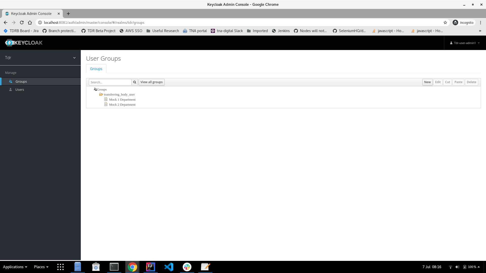
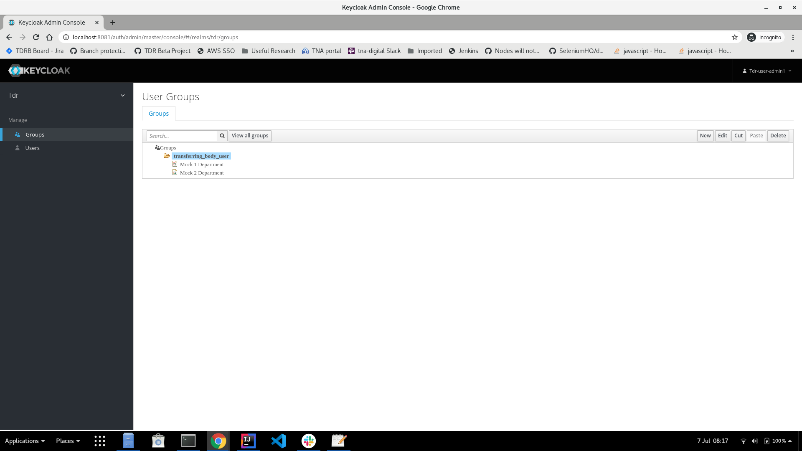
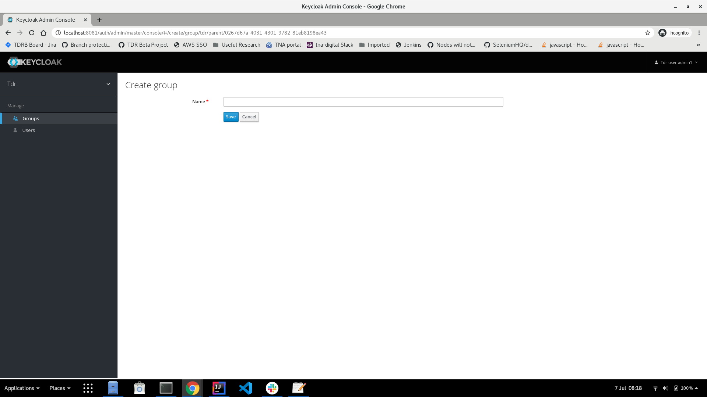
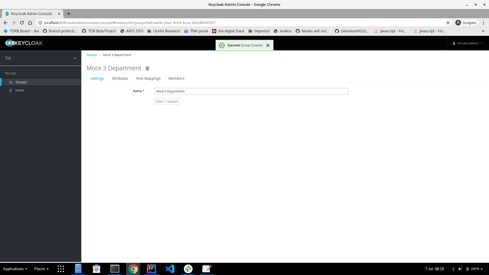
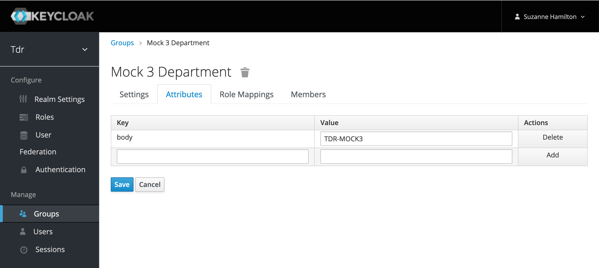
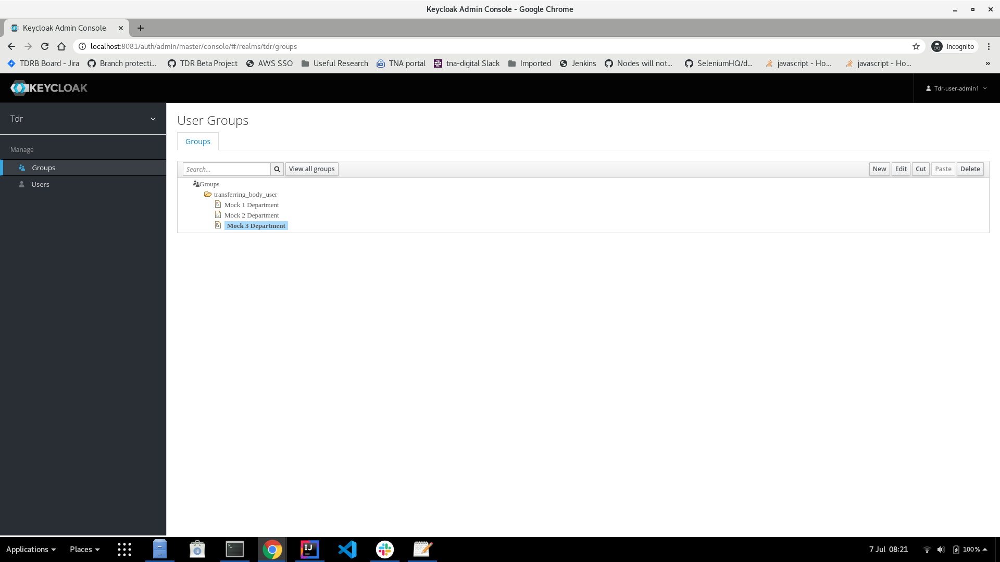
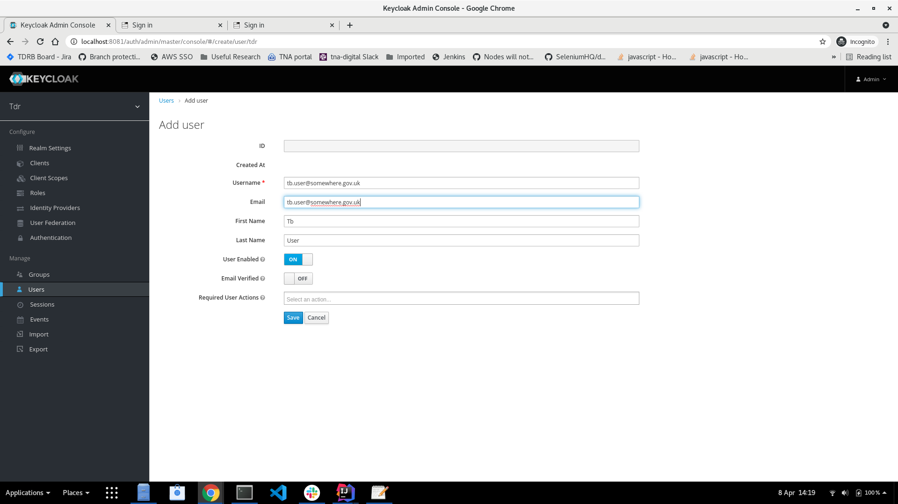
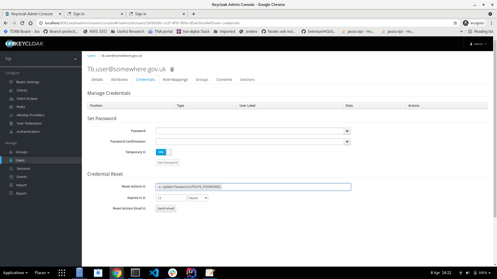
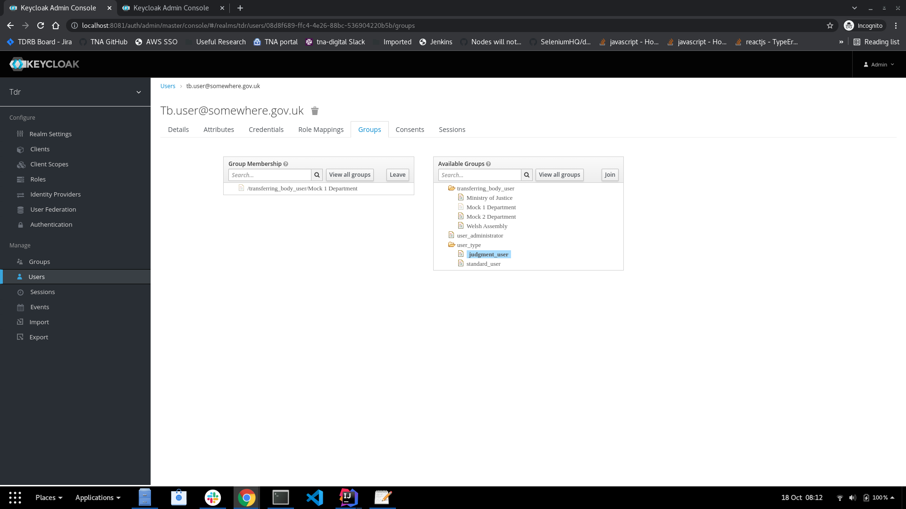

# TDR User Administrator Manual

## Role Description

TDR user administrators have rights and privileges to manage:

1. Transferring body users of the TDR application
  * Create
  * Delete
  * Edit
  * Assign to transferring bodies
2. Transferring body groups:
  * Add
  * Remove
  * Edit

## Setting Up As TDR User Administrator

1. Contact TDR team to request set up as a TDR user administrator: *[email address and other contact details to be confirmed]*
2. You will receive an email from the TDR team with:
  * your user name
  * URL to the Keycloak application
3. A separate email will be sent with an URL link for you to set a password
4. Ensure you have either Microsoft Authenticator (https://www.microsoft.com/en-us/account/authenticator), or Google Authenticator (https://play.google.com/store/apps/details?id=com.google.android.apps.authenticator2&hl=en_GB) available as you will need these to log on to the Keycloak application
5. Log on to the Keycloak application for the first time:
  * **Note**: accessing Keycloak can only be done on the TNA network, via Citrix or connecting to TNA using PulseSecure
  * Go to the provided URL
  * You will be prompted to set scan a QR code with an authenticator application to set up MFA for Keycloak
  
## Managing Transferring Body Users

### Adding a new transferring body

If a new user belongs to a new transferring body not already added to Keycloak, then:
1. Go to the "Groups" page: 
2. Click on the "tdr_transferring_body" group so that it is highlighted: 
3. Click "new"
4. The "Create Group" page will open: 
5. Enter the name of the new transferring body
6. Click "save": 
7. On the new group's page go to the attributes tab
8. Enter a new "body" attribute:
  * In the "key" field enter: body
  * In the "value" filed enter the name of the transferring body 
    * **Note**: the name of the transferring body is only temporary, and in future this will be replaced by a permanent ID value
9. Click the "add" button under the "actions" column
10. Then click "save": 
11. Go back to the "Group" page and under the "transferring_body" group the new transferring body should be visible: 
12. New users can now be assigned to that transferring body. See "Creating a new user" section

### Creating a new user

If a new user needs to be added, then:
1. Go to the "Users" page: 
2. Click on "Add user"
3. Fill in the relevant fields for the new user's details: 
  * The following fields are required to be filled in for a valid user to be created:
    * User Name (this should be the user's email address)
    * First Name
    * Last Name
    * Email
4. In the "Required User Actions" add the following options:  
  * Configure OTP: *(this will enforce MFA)*
    * **Note**: For the moment, do not configure OTP (one-time password). The TDR team are currently working out which multi-factor authentication methods will be supported.
5. Click "save"
6. Under the "Credentials" tab: 
7. Request the updates their password:
  * Under the "Credentials Reset" section add the "Update Password (UPDATE_PASSWORD)" option to the "Reset Actions"
  * Click the "Send Email" button. This will send an email to the user with a URL link requesting they set a password
  * An email confirmation dialog box will appear if the email was sent successfully.
8. Go to the "Groups" tab
9. From the "Available Groups" box select the transferring body the new user belongs to: 
  * If the transferring body does not appear go to the "Adding a new transferring body" section for details of how to add a new transferring body
10. Add the new user to the relevant transferring body.
11. Go back to the Users page
12. Click "View all users"
13. New user should appear in the list of all users: 