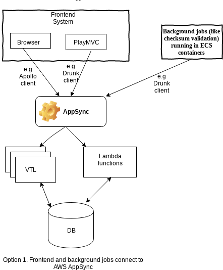
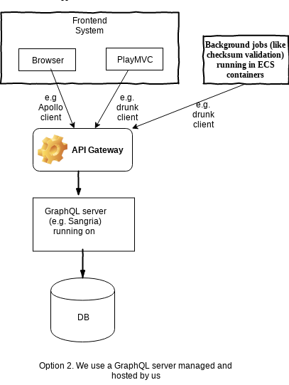

# Options for API management

We want to have an intermediate component between our frontend (which consists of the browser and the Play web application),
the background jobs (that will probably run in ECS and include checksum validation) and the database. 
This component will represent our APIs. The APIs will include virus scanning, format checking, validations of the format.
These components need API clients to communicate with the API, which are different for Javascript, Scala, REST, GraphQL.

The APIs can use the [REST architectural style](https://en.wikipedia.org/wiki/Representational_state_transfer),
or we could also take advantage of [GraphQL](https://graphql.org/), that introduces a schema and a type system, along 
with greater flexibility.

We decided to explore using GraphQL for the following reasons:
- we anticipate multiple datasources, a relational database for keeping the information about files, transfers, users 
 and maybe a nosql solution for auditing (if we decide to put the auditing system in TDR rather than separating it into 
 a different system) and GraphQL will make it very easy to connect to them. 
- we anticipate that it will reduce the amount of data we retrieve from the database, and we won't have to do
multiple calls to get department, series, files for example
- GraphQL is [strong typed](https://graphql.org/learn/schema/). We get a schema that validates the type of the parameters of the query
- comes with nice feature that will speed up development, like out of the box support for [pagination](https://graphql.org/learn/pagination/)

For using GraphQL, we have two different options:

Option 1. Use AppSync, which is a service managed by AWS for a graphQL server



Advantages:
- it's managed by Amazon, so we don't have to worry about a server
- it integrates with AWS Cognito, so we can use the authorisation process that Cognito provides
- websockets out of the box, which is a mechanism to send real time updates to the user

Disadvantages:
- Big lockin to an AWS solution
- the connection to Aurora (a database that we are considering) is not available in the Data API in the
London region. There is a workaround to reach Aurora, but it involves another layer of lambda functions. 

   TODO: We need to ask AWS if there are plans to change this in the immediate future. We have a
workaround that involves accessing Aurora from a resolver that points to a lambda function, but this
creates complexity and potential for hard to maintain code.
- it might be hard to develop code, as it's hard to test locally

   TODO: We need to find out how hard it is to put authorisation and business logic in lambda
resolvers
- the GraphQL client we have started using to connect the scala code to the GraphQL, [drunk](https://github.com/Jarlakxen/drunk)
seems painful in having to create classes and queries. This [sbt plugin](https://github.com/muuki88/sbt-graphql) might 
allow generation of required classes from a schema.

-  [AppSync was launched less than two years ago](https://aws.amazon.com/blogs/aws/introducing-amazon-appsync/) so the tools around it might be immature, and it's long-term support
 is less certain than for the other options.
 
Option 2. Use a GraphQL server that will be managed by us like [Sangria](https://sangria-graphql.org/)



Advantages:
- we could easily connect to the Aurora database
- might be easier to develop locally
Disadvantages:
- we need to do more work for deployment, creating an ECS for example
- we need to add a API GW in front of the GraphQL server, to cater for authorisation, which may be more
complex than just using AppSync

Option 3. Use the REST architecture style, that is less flexible, but better known


Advantages:
- established, well known architecture
- uses standard HTTP status codes and verbs, which integrate well with caching layers and debugging tools
- good client libraries in every language for handling JSON requests and responses
- recommended in the [GDS API standards](https://www.gov.uk/guidance/gds-api-technical-and-data-standards#use-restful)
 

Disadvantages:
- it will require more boilerplate code
- it may require more trips to the database to fetch data

### Observations

##### GraphQL APIs have a strongly typed schema. The schemas can be written in the GraphQL Schema defintion Language

- Simple definition of types and operations.

```
type Consignment {
  id: Int!
  name: String!
  series: Series!
  creator: String!
  transferringBody: String!
  
  input CreateSeriesInput {
    name: String!
    description: String!
  }
 type Mutation {
   createSeries(createSeriesInput: CreateSeriesInput!): Series!
   createConsignment(name: String!, seriesId: Int!, creator: String!, transferringBody: String!): Consignment!
   createFile(createFileInput: CreateFileInput!): File!
  }
  
type Query {
  getAllSeries: [Series!]!
  getConsignments: [Consignment!]!
  getConsignment(id: Int!): Consignment
  getFile(id: UUID!): File
```
- API documentation can be generated form the graphql schema [graphdoc](https://github.com/2fd/graphdoc)
- Types and operations can be validated against schema with Intellij and during codegen

#####GraphQL enables rapid product development

- GraphQL schema definition language easy to learn.  
- Client side code can be generated from queries defined with graphql and the schema. 
```
mutation createConsignment ($name: String!, $seriesId: Int!, ,  $creator : String!, $transferringBody:String!){
    createConsignment(name:$name, seriesId:$seriesId, creator: $creator, transferringBody: $transferringBody ) {
        name,
        id,
        series {
            id,
            name,
            description
        },
        creator,
        transferringBody
    }
} 
```
- Generated code allows very simple graphql request with serialisation and deserialisation
 ```
 Generated code
 
 object CreateConsignment {
   object createConsignment extends GraphQLQuery {
     val document: sangria.ast.Document = graphql"""mutation createConsignment($$name: String!, $$seriesId: Int!, $$creator: String!, $$transferringBody: String!) {
   createConsignment(name: $$name, seriesId: $$seriesId, creator: $$creator, transferringBody: $$transferringBody) {
     name
     id
     series {
       id
       name
       description
     }
     creator
     transferringBody
   }
 }"""
     case class Variables(name: String, seriesId: Int, creator: String, transferringBody: String)
     object Variables { implicit val jsonEncoder: Encoder[Variables] = deriveEncoder[Variables] }
     case class Data(createConsignment: CreateConsignment)
     object Data { implicit val jsonDecoder: Decoder[Data] = deriveDecoder[Data] }
     case class CreateConsignment(name: String, id: Int, series: CreateConsignment.Series, creator: String, transferringBody: String)
     object CreateConsignment {
       implicit val jsonDecoder: Decoder[CreateConsignment] = deriveDecoder[CreateConsignment]
       implicit val jsonEncoder: Encoder[CreateConsignment] = deriveEncoder[CreateConsignment]
       case class Series(id: Int, name: String, description: String)
       object Series {
         implicit val jsonDecoder: Decoder[Series] = deriveDecoder[Series]
         implicit val jsonEncoder: Encoder[Series] = deriveEncoder[Series]
       }
     }
   }
 }
 
 
 Usage:
 
 val vars = createConsignment.Variables(form.get.consignmentName,form.get.seriesId,id.email,form.get.transferringBody)
      graphQlClient.query[createConsignment.Data, createConsignment.Variables](createConsignment.document, vars).result.map {
        case Right(r) =>
          Redirect(routes.UploadController.index(r.data.createConsignment.id)) 
```
- Better tooling support for JavaScript than the adequate level for Scala
- Codegen for Sangria should simplify server side development
- Once schema is defined client and server side development can be done in parallel
- Mock graphql server with responses based on schema [graphql faker](https://github.com/APIs-guru/graphql-faker)
- Client queries can be created and executed from apps such as Postman

##### Graphql results in no more overfetching and underfetching
- Data fetching examples [GraphQL is better than rest](https://www.howtographql.com/basics/1-graphql-is-the-better-rest/)
- With GraphQL, the client can dictate the shape of the response objects returned by the API
- A single server query can provide data that would require many REST endpoints 
  
