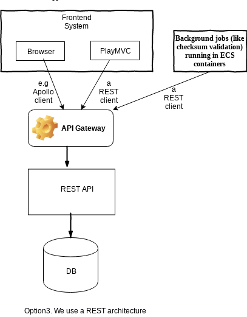

# Options for API management

We want to have an intermediate component between our frontend (which consists of the browser and the Play web application)
and the database. 
This component will represent our APIs. The APIs will include virus scanning, format checking, validations of the format.

The APIs can use the [REST architectural style]  (https://en.wikipedia.org/wiki/Representational_state_transfer),
or we could also take advantage of [GraphQL](https://graphql.org/), that introduces a schema and a type system, along with greater flexibility.

We decided to explore using GraphQL for the following reasons:
- we anticipate multiple datasources, a relational database for keeping the information about files, transfers, users 
 and maybe a nosql solution for auditing and GraphQL will make it very easy to connect to them
- we anticipate that it will reduce the amount of data we retrieve from the database, and we won't have to do
multiple calls to get department, series, files for example
- GraphQL is [strong typed](https://graphql.org/learn/schema/). We get a schema that validates the type of the parameters of the query
- comes with nice feature that will speed up development, like out of the box support for [pagination](https://graphql.org/learn/pagination/)

For using GraphQL, we have two different options:

Option 1. Use AppSync, which is a service managed by AWS for a graphQL server

Advantages:
- it's managed by Amazon, so we don't have to worry about a server
- it integrates with AWS Cognito, so we can use the authorisation process that Cognito provides
- websockets out of the box, which is a mechanism to send real time updates to the user
Disadvantages:
- Big lockin to an AWS solution
- the connection to Aurora (a database that we are considering) is not available in the Data API in the
London region. There is a workaround to reach Aurora, but it involves another layer of lambda functions. 

   TODO: We need to ask AWS if there are plans to change this in the immediate future. We have a
workaround that involves accessing Aurora from a resolver that points to a lambda function, but this
creates complexity and potential for hard to maintain code.
- it might be hard to develop code, as it's hard to test locally

   TODO: We need to find out how hard it is to put authorisation and business logic in Appsync and
resolvers

Option 2. Use a GraphQL server that will be managed by us like [Sangria](https://sangria-graphql.org/)

Advantages:
- we could easily connect to the Aurora database
- might be easier to develop locally
Disadvantages:
- we need to do more work for deployment, creating an ECS for example
- we need to add a API GW in front of the GraphQL server, to cater for authorisation, which may be more
complex than just using AppSync

Option 3. Use the REST architecture style, that is less flexible, but better known

Advantages:
- established, well known architecture

Disadvantages:
- it will require more boilerplate code
- it may require more trips to the database to fetch data 