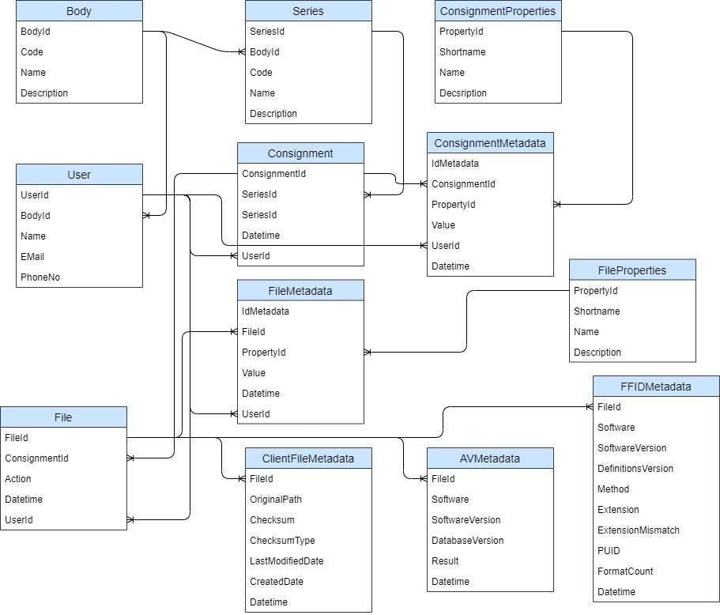

# TDR Database Design

## Summary

This document aims to recommend a suitable database schema, for the TDR
application. Consideration is given to a design which can evolve to
support enhanced metadata capture without introducing an over-prescribed
or rigid nature that may limit the flexibility for use as TDR evolves.

## Scope

The Transfer of Digital Records (TDR) application allows a user of an
organisation to transfer digital records directly to TNA. A database
schema is required to store information to support the TDR application
process and the creation of an export package. An additional requirement
is that the database itself may not to be used for long term storage of
the information and is likely to be purged at intervals of time or after
a transfer has occurred.

The TDR application will have enhanced functionality delivered across
multiple phases releases, consideration for which should be included in
the design of the database schema. Consideration of this at an early
stage will help minimise database maintenance and code changes required
for each of the releases whilst still ensuring data capability.

## Database Design

The following sections propose an initial design for the TDR database
schema. The database design may change in the future to reflect
requirement changes within the UI and / or export package needs.

## Overall Schema

The overall schema proposed is shown below

The following sections detail the tables proposed.

### User

The suggested User table is shown below.

In this table the user is associated with some basic information and a
body. The body is their working organisation and is known as the
"Transferring Body".

Security and user permissions are believed to be enforced in the
application through AWS IAM policy implementations. If this should
change the User table may be modified to support the features required.

At this stage it is not suggested to add audit information such as
lastLogon date to this table but can be extended if required.

| Field | Description | Data Value type | Key Type | Comment |
| ----- | ----- | ----- | ----- | ----- |
| UserId | The internal ID of the User  | | PK             
| BodyId | The ID of the Body the user is related to | | FK | Transferring Body. Assuming a user only has one organisational Body they work for.
| Name | The Name of the user | String | | We could separate first and lastname
| Email | The email address of the user | String                               
| PhoneNo | The phone number of the user | String                               

### Body

In this table the Body is associated with some basic information.

It is not proposed at this stage to add audit information such as
CreatedDate, ModifiedDate or user information to this table but this
information could readily be added if required.

The table proposed reflects a list of Bodies and is not intended to
reflect the current or historical organisational structure within them.

| Field | Description | Data Value type | Key Type | Comment |
| ----- | ----- | ----- | ----- | ----- |
|   BodyId |        The internal id of the Body |  | PK             
|   Code |           The code used for the Body  |  String | |  Example "TNA"
|   Name | The full name of the Body | String | |  "The National Archives"
|   Description |   Description of the Body |        String  | | If required

### Series

In this table the Series is associated with some basic information.

It is not proposed at this stage to add audit information such as
CreatedDate, ModifiedDate or user information to this table but this
information could readily be added if required.

The Series is also associated with a Body which is intended to reflect
the creating organisation of the consignment thst is known as the
"Creating Body".

| Field | Description | Data Value type | Key Type | Comment |
| ----- | ----- | ----- | ----- | ----- |
|  SeriesId | The internal ID of the series | | PK             
|  BodyId | The ID of the Body related to the Series | | FK | Creating Body |
|  Code | The code used for the Series | string  | | |                            
|  Name | The full name of the Series  |     string                               
|  Description |  Description of the Series   |               string                               

### Consignment

The consignment table holds the main identifier and associations for a
consignment.

Properties about the consignment are not directly stored in this table.
Instead a key value style table named ConsignmentMetadata has been used
to capture the properties. See later.

The consignment links to a Series and User and it is these that provide
the relevant link to body information. This approach only considers
Creating Body and Transferring body as the entities to be identified.
This however may need to be reconsidered where enquiries are to be
transferred since it has been suggested that these may have additional
Bodies such as multiple Supporting Bodies.

| Field | Description | Data Value type | Key Type | Comment |
| ----- | ----- | ----- | ----- | ----- |
|   ConsignmentId |    The internal ID for the consignment  | |  PK             
|   SeriesId |        The ID of the series for the consignment | | FK             
|   Datetime  |       Time stamp of insert |  datetime |                             
|   UserId |          The ID of the user that created the consignment  | | FK             

### ConsignmentMetadata

The ConsignmentMetadata table proposed is designed to enable
extensibility for capture data but also to minimise future
administration and development time. Using the key:value approach allows
the addition of any property/ values to be added without the addition of
extra columns.

The properties related to the consignment are kept in a key value style
table with additional audit information. This will allow the properties
attached to the consignment to grow without extension of the table.

This style of table also allows its use as an audit table. If a full
audit trail is desired, then the table would only ever require inserts
and never deletes or updates. Conversely if audit is not required we
could simply insert and then update the value in situ. We may also wish
to consider the addition of CreatedDate and ModifiedDate columns for
basic audit information.

| Field | Description | Data Value type | Key Type | Comment |
| ----- | ----- | ----- | ----- | ----- |
|  IdMetadata  |    Internal ID of the metadata element  |  | PK             
|  ConsignmentId |  The ID of the consignment that the property and value are associated with  | | FK             
|  PropertyId  |    The ID of the consignment property   | |FK             
|  Value   |        The value for the key    |  string                               
|  Datetime |       Time stamp of row creation   |  datetime                             
|  UserId    |      The ID of the user that created the consignment data  | | FK             

### ConsignmentProperties

The proposed ConsignmentProperties table contains a list of properties
that may be associated with a consignment. Basic information is
suggested to be stored for each property

As well as identifying the property linked to from the
ConsignmentMetadata table, the information could also be used within a
UI dropdown and / or the description displayed in a popup on a hover
over event.

The addition of new properties may be achieved within the UI if a user
is allowed to insert new properties.

| Field | Description | Data Value type | Key Type | Comment |
| ----- | ----- | ----- | ----- | ----- |
|  PropertyId |   Internal ID of the property  |   |  PK             
|  Name     |     The full name of the property   | String                               
|  Description |  The description of the property  | String |                            
|  Shortname  |   The short name, code or label of the property |  String  | | To be used in creating the export column header

### File

The File table proposed details the files associated with a particular
consignment. The design also allows for it to be used for audit purposes
if desired by inclusion of the action column. If the audit style is
desired then the table would only require inserts and never deletes or
updates. If an audit on a files actions are not required then we would
insert, update or delete a record. We may also wish to consider the
addition of CreatedDate and ModifiedDate columns for basic audit
information.

| Field | Description | Data Value type | Key Type | Comment |
| ----- | ----- | ----- | ----- | ----- |
|  FieldId |        The internal ID of the file |  PK             
|  ConsignmentId |  The consignment ID the file is related to | FK             
|  Action  |        The action carried out     | string  || Example "added" "deleted" could also use 1 and 0
|  Datetime |       Time stamp of row creation |  datetime                             
|  UserId   |       The ID of the user that added the file to the consignment | | FK             

### FileMetadata

The FileMetadata table proposed is designed to enable extensibility for
data capture but also to minimise future administration and development
time. Using the key:value approach allows the addition of any property /
values to be added without the addition of extra columns. This design is
analogous to that proposed or the ConsignmentMetadata table.

The properties related to the file are kept in a key / value style table
with additional audit information. This will allow the properties
attached to the file to grow without extension of the table.

This style of table also allows for the use as an audit table. If a full
audit trail is desired, then the table would only ever require inserts
and never deletes or updates. Conversely if full audit is not required
we could simply insert and then update the value in situ. We may also
wish to consider the addition of CreatedDate and ModifiedDate columns
for basic audit information.

| Field | Description | Data Value type | Key Type | Comment |
| ----- | ----- | ----- | ----- | ----- |
|  IdMetadata |  Internal ID of the metadata element | | PK             
|  FileId  |     The file that property and value are associated with | | FK             
|  PropertyId |  The ID of the file property  | |FK             
|  Value  |      The value for the key |  string                               
|  Datetime   |  Time stamp of row creation | datetime                             
|  UserId  |     The ID of the user that added the file metadata | | FK             

### FileProperties

The proposed FileProperties table contains a list of properties that may
be associated with a consignment. Basic information is suggested to be
stored for each property.

As well as identifying the property linked to the Filemetadata table,
the information could also be used within a UI dropdown and / or the
description displayed in a popup on a hover over event.

The addition of new properties may be achieved within the UI if a user
is allowed to insert new properties.

Note: On an aside we may wish to consider merging the FileProperties and
ConsignmentProperties tables. If this was required we may wish to add a
new column "PropertyType" to identify the property as either "File" or
"Consignment".

| Field | Description | Data Value type | Key Type | Comment |
| ----- | ----- | ----- | ----- | ----- |  
| PropertyId |   Internal ID of the property  | PK             
|  Name |         The full name of the property |  String |                              
|  Description |  The description of the property | String |                              
|  Shortname |    The short name, code or label of the property |  String | | To be used in creating the export column header

### AVMetadata

The AVMetadata table is proposed to hold information gathered during
anti-virus analysis of a file.

The columns suggested are to capture the software and versions used to
analysis the files. If a file is to be analysed by multiple anti-virus
packages it is suggested a row be added for each analysis.

The exact nature of the Result columns used to capture the result of the
analysis will need to be discussed further since the nature or style of
results may vary between anti-virus software packages.

| Field | Description | Data Value type | Key Type | Comment |
| ----- | ----- | ----- | ----- | ----- |  
|  FileId |           The ID of the file analysed || FK             
|  Software | | String                               
|  SoftwareVersion | | String                               
|  DatabaseVersion ||  String                               
|  Result | | String  ||                             The result returned... Need to clarify what is returned.. may need more columns
|  Datetime |         Time stamp of row creation  |  datetime                             

### ClientFileMetadata

The ClientFileMetadata table is suggested to hold information gathered
during initial client side analysis before the files are uploaded.

The checksum and algorithm used will need to be captured for file
verification later in the TDR process. Should multiple checksums be
created then more than one row can exist for a file.

The original path is required as the TDR export package (bagIt Bag) will
need to be created using the same folder hierarchal structure and the
files placed at the appropriate place.

The use of specific column names within the table, rather than the
Key:Value style used in the FileMetadata table is suggested since the
properties captured are unlikely to change very much.

| Field | Description | Data Value type | Key Type | Comment |
| ----- | ----- | ----- | ----- | ----- | 
| FileId      | The ID of the file analysed |             | FK          |             |
| OriginalPath | The full file path of the original file| String      |             | Or as much as we can get. i.e. starting from top level folder that  was selected to transfer
| Checksum    | The value of the checksum  | String      |             |             |
| ChecksumType | sha256, md5 | String      |             |             |
| LastModifiedDate  |             | datetime    |             |             |
| CreationDate |             | datetime    |             |             |
| Filesize    |             | double      |             |             |
| Datetime    |             | datetime    |             |             |

It is appreciated that the full original path and the file creation date 
may not be accessible. The last modified date and relative path of a file from
the consignment folder would be acceptable and would not cause issues with creating the bag. 
 
### FFIDMetadata

The FFIDMetadata table is proposed to hold the information gathered
around file format identification and the software used for the
analysis. Multiple rows may exist for a file where multiple formats are
identified from an analysis or where multiple analysis have been carried
out.

| Field | Description | Data Value type | Key Type | Comment |
| ----- | ----- | ----- | ----- | ----- | 
|  FileId |  The ID of the file analysed | FK             
|  Software | | String |                              
|  SoftwareVersion  | | String   |                           
|  DefinitionsVersion || String                               
|  Method || String                               
|  Extension  | |String                               
|  ExtensionMismatch || String                               
|  FormatCount  || String                               
|  PUID   || String                               
|  Datetime  || datetime                             
