# TDR Export Format

## Summary

This document aims to recommend a suitable export package, for the TDR
application, which conforms to acceptable standards. Consideration is
also given to a format which can evolve to support enhanced metadata
capture without introducing an over-prescribed or rigid nature that may
limit the flexibility for use elsewhere in TNA.

## Scope

The Transfer of Digital Records (TDR) application allows an organisation
to transfer digital records directly to TNA. As part of the transfer
process TDR is intended to create a delivery package containing the
files transferred, any information about the files and the TDR process
that may be relevant.

The export package may be used by other applications for a variety of
purposes, such as the creation of a DRI ingest package or auditing of
various attributes.

Investigations into a suitable design for the TDR export package have
focused on being extensible, have simplicity in mind to create and use,
for both computer and human, and whilst adhering to standards where
possible.

Many standards exist for expressing information around digital libraries
such as METS, Premis, XIP, E-Ark, BagIt and OCFL. Some of these have
tendencies towards specific information package styles based on the OAIS
package type specifications. As the TDR package may be used for a
variety of purposes, the creation and expression of the information
biased towards an OAIS package type from the outset may not be required.
The use of xml within these packages descriptors may not cause issues
for computers to read but may hamper humans who wish to quickly browse
and understand the included information.

## Evaluation of Standards

The E-ARK specification details implementations for SIP, AIP and DIP and
defines an extensive xml model/schema to support each. In doing so it
creates some of its own xml structure and reuses xml exerts from METS
and Premis at appropriate levels. Whilst E-Ark is very comprehensive it
is also quite detailed and targeted towards a more specific purpose
which may add unnecessary complexity for TDR purposes.

In comparison the BagIt specification is quite generic and applies a few
basic ideas to allow file consistency to be checked.

BagIt does not regard itself as a type of OAIS information package.
BagIt specifies how files are packaged into a Bag and how information
about the Bag can be described. It does not mandate how file level
metadata is formatted or included however the specification does allow
for the addition of other files to be included in the bag. These are
known as Tag files. This feature may prove beneficial for its use with
TDR since it would allow the inclusion of any information and audit
trails that may be required to support business requirements. The tag
files themselves might be simple delimited file formats, rather than xml
schemas, that would also allow users to browse the information easily.

The Oxford Common File layout (OCFL) was another specification examined
and on inspection is quite similar to the BagIt specification. OCFL
however goes a little further and allows the categorisation of a multi
version package.

The OCFL specification also allows the inclusion of a BagIt Bag as a
version description.

If versioning of sets of files was required, OCFL would be very useful
however since TDR, at this stage, is not proposed to work with
multi-version transfers the BagIt specification would be sufficient to
support TDR requirements. Should versioning become a requirement of TDR,
the extension to use the OCFL specification for the export package on
top of the existing BagIt Bag, would be a minor enhancement to
implement.

BagIt does not regard itself as an OAIS package type however several
software applications do allow its ingest into archival systems.

The processing of the TDR export package for ingest into an archival
system is proposed to be carried out by a further processing engine.
However this engine is not currently in the scope of TDR and is
therefore not discussed further in this document.

## Recommended Approach

The proposed intention of TDR is to assist with the transfer of files
and delivery of a package containing the files and required information
about them. The BagIt specification would appear to fit well with the
TDR requirements whilst allowing further extensibility. BagIt is
therefore recommended for use as the TDR export format.

## BagIt Specification

BagIt defines a simple file naming convention used by the digital
curation community for packaging up arbitrary digital content as a
payload, so that it can be reliably transported via both physical media
(hard disk drive, CD-ROM, DVD) and network transfers (FTP, HTTP, rsync,
etc.). 

The BagIt specification is organised around the notion of a "bag". A bag
is a named file system directory that minimally contains:

-   A "data" directory that includes the payload, or data files that
     comprise the digital content being preserved. Files can also be
     placed in subdirectories, but empty directories are not supported.

-   At least one manifest file that itemises the filenames present in
     the "data" directory, as well as their checksums. The
     particular checksum algorithm is included as part of the manifest
     filename. For instance a manifest file with sha256 checksums is
     named "manifest-sha256.txt".

-   A "bagit.txt" file that identifies the directory as a bag, the
     version of the BagIt specification that it adheres to, and
     the [character
     encoding](https://en.wikipedia.org/wiki/Character_encoding) used
     for tag files.

-   Both the manifest-\<checksum\>.txt and the bagit.txt are known as
     tag files.

On receipt of a "bag" a piece of software can examine the manifest file
to make sure that the payload files are present, and that their
checksums are correct. This allows for accidentally removed or corrupted
files to be identified. 

The "bag" may contain other tag files:

-   bag-info.txt is a file that describes property information at the
    bag level which could be about the bag itself or properties that
    apply to all data files being packaged. Fourteen standard properties
    are defined in the BagIt specification however any other custom
    properties may be included.

-   Other tag files may be included to describe any further information
    as required.

-   If further tag files are included a tag manifest file should also be
    included that identifies each tag file as well as their checksums.
    The naming convention is in line with the previous manifest file
    name. E.g. tagmanifest-sha256.txt for a list of the tag files and
    their sha256 checksums.

## Application of BagIt for TDR

The BagIt specification is quite broad and open within a guideline framework and it is this which suggests its suitability for use as the export format for TDR. TDR is likely to evolve through phased releases and any increased information required to be captured may be added into Tag Files.

The bag-info.txt file contains information at the Bag level. This
coincides with consignment level information within TDR and may also
contain details of any information around the TDR process itself. Tag
files may readily be added describing file metadata, property audit logs
and any other information as required.

In the next section the Bagger client software, created by the Library
of Congress, is used to demonstrate how the BagIt approach may be
applied for the TDR export package with descriptions of each of the
files to support information transfer.

## Example BagIt Implementation for TDR.

A Bag is simply a top level directory that is used to hold all of the
data and information for a bag. As part of the TDR process the
consignment ID and the series ID will be known or created. The naming of
the Bag directory could easily benefit from using the consignment and
series information for visual identification even though there is no
naming convention defined for it in the BagIt specification.

For the moment the Bag directory has been named "TDRConsignmentBag". The
TDRConsignmentBag directory has a sub directory named "data" which
contains the actual consignment of files. This is as described by the
specification.

For this example the consignment is a directory named "OdataReports"
containing two files (Book1.xslx and Droid Charts.xslx)

The basic bag would look like this.

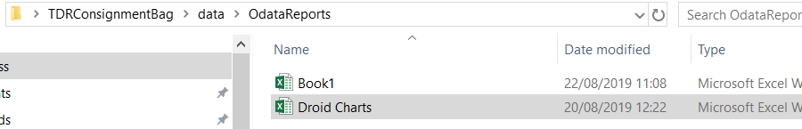

The TDRConsignmentBag directory requires default tag files to be
included in the bag.

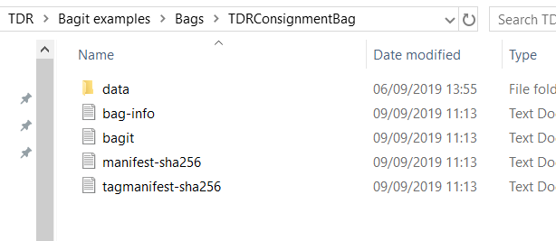

The bagit.txt file simply details the BagIt version and the encoding
format.

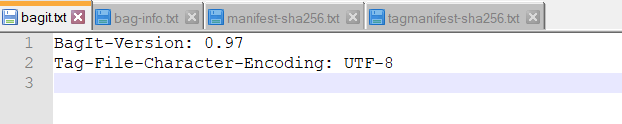

The manifest-sha256.txt file contains the sha256 and the file identifier
of the consignment files. The path is always referenced from the data
directory.

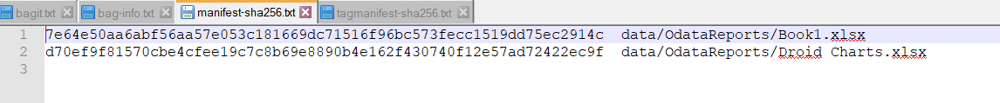

The tagmanifest-sha256.txt file contains the sha256 and the file
identifier of the tag files.

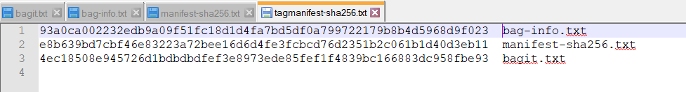

The information shown above demonstrates the minimum required to create
a valid bag. However this may not be sufficient for the needs of TDR if
further information is required to be transferred along with the files.

Tag files may be used to accomplish the transfer of file level
information / metadata. Possible suggestions are shown below.

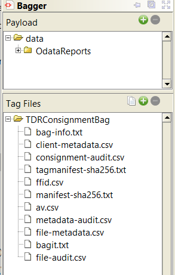

Some of these files may not be required to exist as part of the bag and
depends on the requirements for TDR. However suggestions are currently
included here for completeness.

The additional tag files are proposed to record information for a
specific purpose rather than have information bundled into a single more
complex file format such as xml. A simple csv format is proposed for
these files as this may aid with visual inspection of the data once
received and for simplicity of creation by the TDR application.

Once created any additional tag files must also be included into the
tagmanifest-\<checksum\> file as shown below.

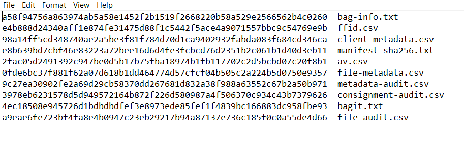

The following section makes some suggestions for these additional files
and their contents.

### Consignment and Process information

The consignment level information and details of the TDR process are
proposed to be recorded in the bag-info.txt file. Any properties and
values added to this file would be the final values of the properties at
the time of bag creation.

The following list of properties is suggested but can be amended or
enhanced by the TDR application to fulfil any further requirements that
may be set.

 | Property  | Description | Example value | Property Type | Possible BagIt Descriptor |
 |-----------|-------------|---------------|---------------|---------------------------|
 |Bag-Creator| Name of software and version that created the bag |  TDR 1.0  |Custom  |        
 |Bag-Size | The size of the complete bag package | 86.2 KB | BagIt           
 |Bagging-Date | Date the bag was written | 2019-09-09 | BagIt           
 |Browser | The name and version of the browser | | Custom          
 |Consignment-Identifier | Unique TDR code for this consignment ||Custom | BagIt:External-Identifier
 |Consignment-TransferringBodyCode | The Code of the transferring Body || Custom | BagIt:Internal-Sender-Indentifier
 |Consignment-TransferringBodyName | The name of the transferring Body| | Custom | BagIt:Internal-Sender-Description
 |Consignment-CreatingBodyCode | The Code of the creating Body || Custom          
 |Consignment-CreatingBodyName | The name of the creating Body || Custom          
 |Consignment-Series | The series for the consignment || Custom | Bagit:Bag-Group-Identifier
 |User-DeclarationDate | Usage tern acceptance date|| Custom|
 |User-DeclarationAccepted | Whether the user accepted the usage terms|| Custom          

The format of the bag-info.txt data is defined by the specification and
is shown below.

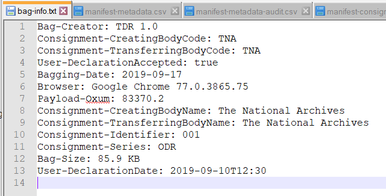

Prefixes to the property names could be added as a means to identify or
discriminate between TDR and BagIt defined properties. However if this
is done the prefix separator should not use a ":" since this is defined
by BagIt as the delimiter for a property and its value.

### Consignment Audit

Should an audit of the consignment level properties be required the
following approach may be used as a solution.

Should any of the values change, be added or deleted during the TDR
process an audit could be created. The creation of a "consignment-audit"
file containing a simple list of properties to track the values, dates
and users may suffice.

A simple .csv format for the file is proposed and an example is shown
below

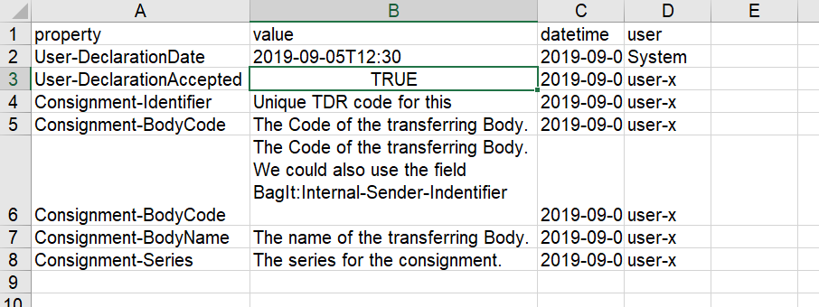

Initial values of any properties directly related to the consignment and
submitted by the user could be captured.

### Payload metadata

In addition to consignment and process information the TDR export
package is proposed to include information around the file metadata and
possibly an audit of this information.

The following sections provide examples for the additional tag files
suggested to convey the required information.

#### File Metadata

A tag file named "file-metadata" is proposed to contain the final values
of each the metadata properties wishing to be captured for each file.
This file does not limit or define the properties to be captured, other
than the "file" column. However this approach allows the definition of
any properties required using column headers.

Whilst the format of the file could be anything we recommend a simple
.csv structure with a row describing each file in the payload.

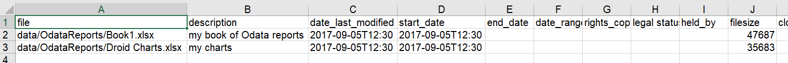

Some of the information required in the DRI csv schema files is
available from the bag-info.txt information and is not proposed to be
repeated in the metadata file. Although it is possible to de-normalise
some of the information such as body and series and have it included if
desired.

#### Metadata Audit.

In situations where a single or multiple users have edited the values of
properties it may be necessary to track or determine who edited what and
when for the purposes of provenance and accountability.

Should the need arise, it is proposed that a tag file named
"metadata-audit" is created for the historical audit trail of metadata
values. A simple csv format for would suffice.

A proposed example is shown below.

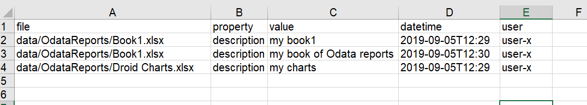

The initial values of any property with its initial date may also be
recorded in this format even if it has not later been updated or
amended. If a value is deleted, a null is suggested to be shown as the
value.

#### 

#### Clientside Metadata

To ensure files are uploaded correctly the TDR application will carry
out nominal client side evaluation on the files. It is recommended that
this information is also captured as part of the consignment bag payload
as the tag file "client-metadata".

An example of the proposed format is shown below

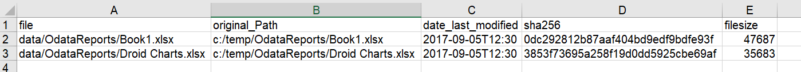

If multiple checksums are created for a file, a column may be added for
each method used... e.g. sha256, md5 etc.

#### File format

Once the TDR application has copied the payload files to a central
server, a file format identification analysis is intended to take place.
The software used to achieve the analysis and the results of the ffid
analysis can be recorded in a tag file named "ffid" to achieve this, the
proposed base fields and format of which are suggested below.

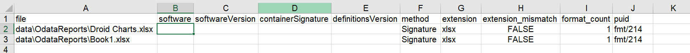

If multiple file formats are identified for a file, a row may be added
for each.

#### Antivirus

Once the TDR application has copied the payload files to a central
server a file virus-check will take place. The software used to achieve
the analysis and the results of the virus analysis can also be recorded
in a tag file named "av" to achieve this, the proposed base fields and
format of which are shown below.

#### 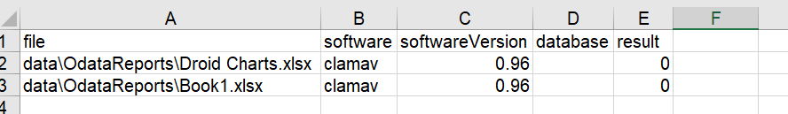

#### 

#### File Audit

The TDR process allows a user to add folders / files to the consignment.
In later versions it is anticipated that the user will be able to
delete, add or replace files individually. If required this activity
could be recorded in a tag file "file-audit". The proposed properties
and format are shown below.

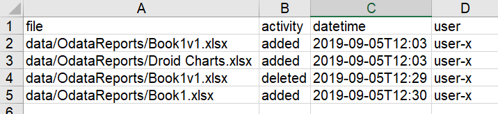

A further complication exists if this approach is used. In the current
DRI process, it has been requested by organisations that a file be
removed. This can occur for a variety
of reasons. It may be required that the TDR process tracks these changes
but they are not created in the consignment bag and, once the TDR
process is complete, the file tracking could be deleted from the TDR
database.

Further work is required to identify the requirements around this area.

## Conclusion

The approach outlined above is proposed to deliver a package containing
the required information for use in multiple ways for a variety of
purposes. The approach is also consistent with the BagIt definition and
as such it is a standards based approach.

Some aspects may not be required for certain TDR phased releases. It is
for the business to decide which elements are retained or omitted for
TDR phases. 

                                              
                                              
