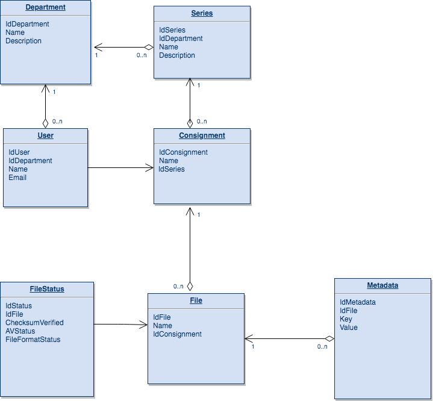

# Database choice for information on files and metadata

Once a user login to TDR, he will see a list of series that are pre-populated 
for the department the user is a part of.

If a consignment is in progress, the user will also see it and possibly resume 
work on it.

In order to do this, the system must store information on the files, the metadata and also the status of the processing on each file.

We have started prototyping this model with a relational database, [Amazon Aurora](https://aws.amazon.com/rds/aurora/) for the following reasons:
- ease of use 
- fixed schema - although the schema will evolve while we design the solution, we expect to be well known and not change once we progress to beta
- small size - database is purged after the transfer is confirmed as finished.

