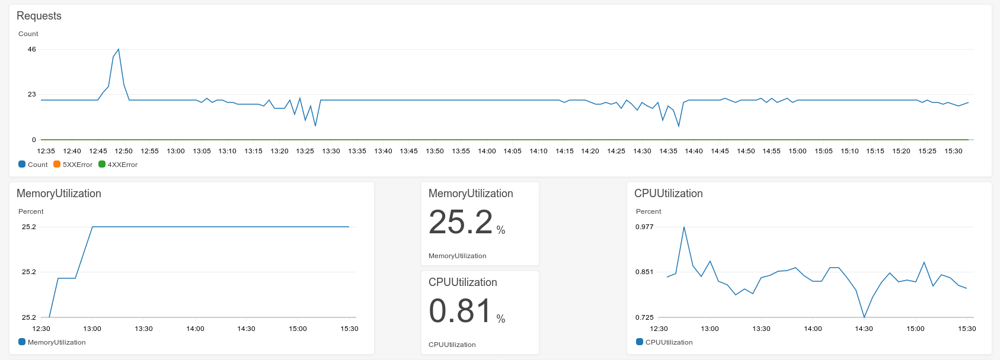
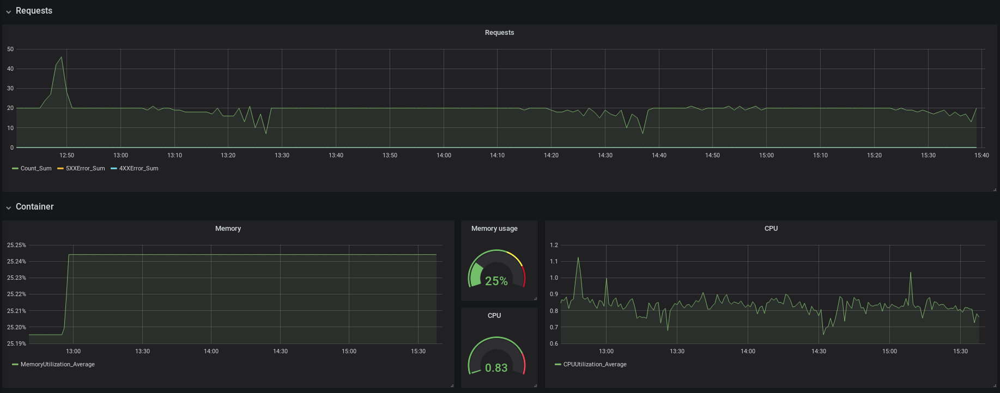

# Monitoring options

## Background

In Beta, and once we've launched TDR, the development team will have to ensure
the service is available and debug any issues. The [initial architecture][arch],
while it doesn't have a huge number of services, is still quite complex. And
developers supporting the system won't necessarily have been involved in
building it, so we need to make inspecting and debugging the system as simple as
possible.

There are lots of overlapping and complementary tools for helping developers
solve these problems: metric monitoring, logging, alerting systems, tracing,
and (more recently) event-based observability tools. This investigation focuses
on monitoring because we know we'll need at least _some_ metric dashboards to
monitor things like the performance of the ECS services. We're planning to look
logging options in the near future, and we're aware of the tracing and
observability tools and might investigate them too.

This investigation just covers tools for helping developers maintain TDR. It
doesn't include some other topics that might also be referred to as
"monitoring", and which we'll look into separately:

- Auditing: records of who edited what data and when
- Usage metrics, e.g. how many consignments are in progress
- Security monitoring and alerting

[arch]: https://github.com/nationalarchives/tdr-dev-documentation/blob/master/beta-architecture/beta-architecture.md

## Options

We considered a few different options, which all do slightly different things:

- [AWS CloudWatch metrics][cw-metrics]: metrics collection and visualisation.
  TDR is hosted on AWS, so CloudWatch will collect a lot of useful metrics by
  default, e.g. ECS memory usage, SNS message counts or Lambda errors. It can
  also collect custom metrics and provides a way to build dashboards to
  visualise them.
- [Prometheus] and [Graphite]: open source metric storage. Basic visualisation.
- [Grafana]: open source metrics visualisation. No data storage - it pulls in
  data from CloudWatch, Graphite and Prometheus, as well as other tools like
  Elasticsearch (e.g. [ELK] logs)

There are also commercial providers, but we generally prefer open source tools.
We're including CloudWatch because of the convenience of using the metrics
collected by our hosting platform.

[cw-metrics]: https://docs.aws.amazon.com/AmazonCloudWatch/latest/monitoring/working_with_metrics.html
[Prometheus]: https://prometheus.io/
[Graphite]: https://graphiteapp.org/
[Grafana]: https://grafana.com/
[ELK]: https://www.elastic.co/what-is/elk-stack

### Metric collection

Prometheus and Graphite look like they would be useful for collecting custom
metrics from TDR's web services and background tasks. Both tools are set up to
collect custom metrics in a way that interferes as little as possible with the
application being monitored. Pushing custom metrics to CloudWatch is possible
through the AWS API, but we'd need to take care to make sure that a metric
request failure doesn't cause an error in the application.

It is also possible to convert CloudWatch logs to CloudWatch metrics using a
[metric transformation][metric-transform]. This is useful because you don't have
have to add an extra call to save a metric. It has some limitations, though -
you cannot currently add [dimensions][cw-dimensions] this way.

Despite these limitations, we're going to start building TDR using CloudWatch
metrics because of the convenience of the auto-genenerated metrics. We can
revisit alternatives like Prometheus and Graphite if we find it difficult to
measure what we need with just CloudWatch metrics.

[metric-transform]: https://docs.aws.amazon.com/AWSCloudFormation/latest/UserGuide/aws-properties-logs-metricfilter-metrictransformation.html
[cw-dimensions]: https://docs.aws.amazon.com/AmazonCloudWatch/latest/monitoring/cloudwatch_concepts.html#Dimension

### Visualisation

Two of the monitoring options above let you build complex metric dashboards:
CloudWatch and Grafana.

CloudWatch lets you build dashboards of graphs from metrics. Example:

Dashboards [can be defined in Terraform][tf-cw-dashboard], so we could define
them in our Terraform scripts to make them reusable across environments.

Grafana can pull in data from CloudWatch and lets you build similar dashboards:

Grafana is a web application, so we would need to host the application and its
database. The database is very lightweight, since it's only used to store things
like dashboard templates and user details, not the data itself (which stays in
CloudWatch and is fetched each time using the AWS API).

The main advantage of Grafana are that it can be used for multiple data
sources. So we could add data from an ELK stack if we create one, or from
Prometheus/Graphite if we ever use them. There is also a [plugin for adding
CloudWatch Logs Insights data][grafana-cw-insights], though it was quite tricky
to set up.

Grafana dashboards are generally more powerful, because it's a widely-used open
source tool. For example, you can set [query variables][grafana-variables] to
build a dashboard that works for multiple services at once. For example, you can
create a generic S3 bucket dashboard which lets you see the same graphs for
every S3 bucket. To do the same thing in CloudWatch, you would have to build a
new dashboard for each bucket.

We've decided to try out Grafana in TDR Beta. We can add extra data sources if
we need them, or switch to CloudWatch dashboards if Grafana maintenance is
outweighing the benefits.

[tf-cw-dashboard]: https://www.terraform.io/docs/providers/aws/r/cloudwatch_dashboard.html
[grafana-cw-insights]: https://github.com/mtanda/grafana-aws-cloudwatch-logs-datasource
[grafana-variables]: https://grafana.com/docs/grafana/latest/features/datasources/cloudwatch/#query-variable

## Grafana implementation notes

The prototype Grafana dashboard for Alpha was set up manually in the AWS
Console. In Beta, it should be Terraformed. Whoever writes the Terraform script
should check the Grafana prototype for the environment variables that need to
be set.

The prototype runs in a Fargate ECS container, and connects to AWS Aurora
Serverless. We thought that Serverless would be a good fit because graph access
will be intermittent, so we would only need to start the database when someone
looks at a dashboard. Unfortunately, this doesn't work because Grafana polls the
database for alerts every 10 seconds, so the DB always needs at least one
instance running.

In Beta, we could try running SQLite on a file system like EFS. This would mean
that we have to run Grafana on an EC2-backed ECS cluster (since you cannot
currently connect Fargate to EFS).

The prototype was deployed from the [main grafana Docker image][grafana-docker].
In Beta, we could extend this and configure the dashboards in our Docker image.

[grafana-docker]: https://hub.docker.com/r/grafana/grafana/
