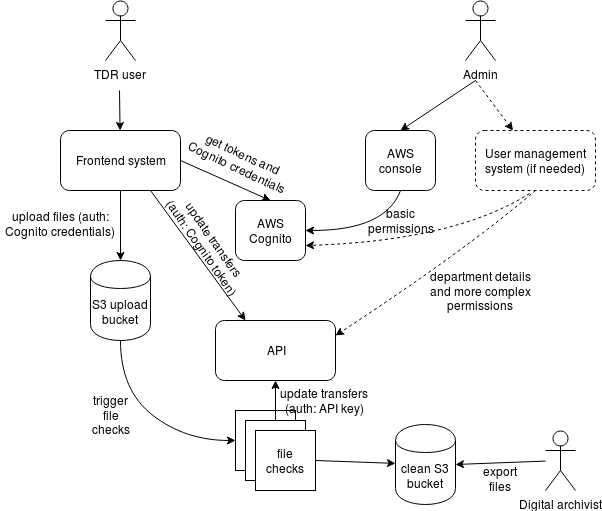

# User management in Cognito

## Summary

- AWS Cognito will let us do all the user management we need for the prototype
- If we want to add control access by department in a later phase, we can do
  this in Cognito but we'll have to decide between using groups or custom
  attributes (which have different trade-offs)
- If we want to add even finer-grained access like giving users access to
  individual transfers, we will probably need to build a custom system (which
  might be some admin-only pages in TDR) to manage those permissions
- We'll probably need to build some admin tools anyway to add department details
  like name and department code
- There are some open questions around how archivists will bulk export files for
  preservation, which might affect user management

## Context

We've been considering using [AWS Cognito][cognito] for user authentication and
authorization in TDR because it will integrate well with the other AWS resources
used by TDR, e.g. [S3 storage][s3].

We want to make sure that Cognito will fit the user management and auth
requirements of TDR, so we've done some basic prototyping to find out.

[cognito]: https://aws.amazon.com/cognito/
[s3]: https://aws.amazon.com/s3/

## Requirements and assumptions

The TDR project is currently in its Alpha phase, so this is just our current
understanding of the user management and auth requirements. It may change as we
learn more about the user needs and the other technical considerations.

Some of these requirements (e.g. anything to do with collaboration) won't be
needed for the MVP, but we think they'll be needed in the next phase.

### Requirements

- An admin user can:
  - create, update and delete all types of TDR users
  - assign users to user groups (e.g. digital archivists)
  - assign users to a department or transferring body
  - possibly create and update department details
- A departmental user:
  - can view and update details of their own transfers (or perhaps ones
    belonging to their department)
  - cannot view or update other users' (or departments') transfers
  - can upload the files they want to transfer to The National Archives
  - cannot view or update files belonging to another user (or department)
  - sees their department name on the TDR dashboard
- A departmental records officer can view and update all transfers belonging to
  their department
- A transfer advisor can see _all_ transfers and files in TDR
- A digital archivist can export the transfer details and files once a transfer
  is ready
- TDR needs to support around 500 departments and transferring bodies

### Assumptions

- A user's ID, department and user type (departmental user, etc.) are all TDR
  needs to authorize a request; we won't need a more complicated permissions
  system in future. **This is a big assumption** because we can imagine
  scenarios where we need to give an individual user access to a specific subset
  of a department's transfers, or we need to handle department hierarchies in
  some way.
- We won't need to support any login system other than Cognito user pools
- For the TDR prototype, we can assume that a user is only a member of one
  department. In future we might need to support users who transfer files
  on behalf of multiple departments.

## Proposed solution

This is how we could use Cognito to meet those requirements.



### User management

#### AWS configuration

Admin users are AWS IAM users who have permission to update Cognito users in the
TDR user pool.

There is a Cognito user pool which contains all the non-admin users (i.e.
departmental users, digital archivists and transfer advisors).

The user pool has a small number of [groups][cognito-groups], corresponding to
the different user types (e.g. digital archivists).

The user pool has a [custom attribute][custom-attributes] called something like
`department` or `transferring-body`.

[cognito-groups]: https://docs.aws.amazon.com/cognito/latest/developerguide/cognito-user-pools-user-groups.html
[custom-attributes]: https://docs.aws.amazon.com/cognito/latest/developerguide/user-pool-settings-attributes.html#user-pool-settings-custom-attributes

##### Groups vs attributes

The reason for using attributes rather than groups for departments is because
AWS has a [soft limit of 300 user groups per pool][group-soft-limit], and a
[hard limit of 500][group-hard-limit], so we might not have enough groups to
support all transferring bodies.

There are a few downsides to attributes, though:

- An attribute has a single value, so it's hard to add a user to multiple
  departments. We'd have to use a workaround, like having multiple department
  attributes or using a single attribute with a comma-separated value.
- An admin user cannot set an attribute (i.e. assign a user to a department)
  through the AWS console UI. You have to use the [AWS CLI][cli-set-attribute],
  which might be difficult for an admin who is unfamiliar with CLIs or who does
  not have permission to install the AWS CLI on their computer. Alternatively,
  we could add an admin UI to TDR for creating users.
- The main use-case for attributes is for profile information like a user's
  name or date of birth, i.e. properties that a user would normally have
  permission to update. It's possible to use attributes for permissions, but
  we'll need to ensure that none of the Cognito pool's app clients have [write
  access to the department attribute][app-client-config].
- Attributes are entered as free text, so admin users might mistype the
  department ID when updating a user, which would prevent that user from viewing
  their department's transfers.
- You cannot [delete or rename a custom attribute][delete-attribute] once it has
  been created in a user pool. That's not a huge problem, but we might end up
  with a confusing list of deprecated attributes if we change our minds about
  the attribute name.

User groups and attributes can both be used for authorization against S3 and
APIs, so we could consider using groups to assign users to departments to begin
with. We'd have to migrate the data to attributes if we hit the group limit.

[group-soft-limit]: https://docs.aws.amazon.com/general/latest/gr/aws_service_limits.html#limits_cognito_user_pools
[group-hard-limit]: https://docs.aws.amazon.com/cognito/latest/developerguide/limits.html#limits-hard
[cli-set-attribute]: https://docs.aws.amazon.com/cli/latest/reference/cognito-idp/admin-update-user-attributes.html
[app-client-config]: https://docs.aws.amazon.com/cognito/latest/developerguide/user-pool-settings-client-apps.html
[delete-attribute]: https://forums.aws.amazon.com/thread.jspa?threadID=240957

#### Process for adding a new user

A department which has already used TDR wants to add a user account so someone
new can transfer the department's records to TNA. Someone from the department
contacts TNA (e.g. by email) and asks for the new account to be created.

An admin user signs into the AWS console and browses to the TDR Cognito user
pool. They click "Create user" and set the username, email address and temporary
password for the new user.

If the new user needs extra permissions, the admin user browses to the Cognito
user pool's groups, and adds the user to the group.

The admin user uses the AWS command line to [set the user's department
attribute][cli-set-attribute] because (as mentioned above) it's not possible to
set attributes in the AWS console UI.

**Alternatively**, we could build some user management pages into TDR (or a
separate user management app) which let the admin do everything through our own
web UI. The app would call the AWS API to update the users in Cognito.

#### Process for adding a new department

An admin user will sign into the TDR management system (which might be part of
TDR or might be a separate app). They will enter the new department's details.
This might include the name (which is shown to TDR departmental users), code
(which is used when exporting data for preservation) and the group or attribute
ID to use when linking a user to a department.

### Authorization for file uploads

File upload requests are started by JavaScript running in the user's browser.
The user is signed into Cognito, so the request is authenticated by a [Cognito
identity pool and ID token][cognito-credentials].

We also need to authorize the request, to make sure that a user cannot affect
another user's transfers. This means that we need to create an [IAM
policy][iam-s3-policy] that grants a user access to a specific bucket or folder
within a bucket.

It doesn't look simple to do this on a department-wide basis. We would have to
create a separate bucket and IAM role for each department, and add a new rule
for each department to the Cognito identity pool's rules for assigning roles to
users. In any case, this couldn't handle more complex cases, like users who
belong to multiple departments, or transfers which should only be seen by some
users in a department.

A simpler solution is to give each user permission to upload files to their own
user-specific folder, so they can never view or overwrite another user's
transfers.

This can be done by creating a TDR identity pool for S3 uploads, and adding
permissions to the authorized role's policy like this:

```
{
    "Sid": "SomeSid",
    "Effect": "Allow",
    "Action": "s3:PutObject",
    "Resource": "arn:aws:s3:::some-bucket-name/${cognito-identity.amazonaws.com:sub}/*"
}
```

`cognito-identity.amazonaws.com:sub` is a unique value for each Cognito user.
It's not a very human-readable ID, because it's based on an AWS region and a
UUID rather than the Cognito user ID, e.g.
`eu-west-2:4b9dee29-587b-453e-bddb-74349e405c34`. But it is unique and can be
looked up in the TDR app.

We can get this ID in the TDR app JavaScript component by calling:

```
const identityPoolCredentials = new AWS.CognitoIdentityCredentials({
    IdentityPoolId: "some-identity-pool-id",
    Logins: {
        some-user-pool-id: session.getIdToken().getJwtToken()
    }
});

const identityPoolUserId = identityPoolCredentials.identityId;
```

This means that each user uploads files to their own space in S3. The TDR
backend can perform the file checks on those files, and then copy them to a
separate "safe" TNA bucket or folder.

The drawback with this approach is that if several user collaborate on a
transfer, the uploaded files will be split across folders. But we can store the
location of the files in the database, and merge the contents when we copy the
data to the TNA bucket or folder.

If that turns out to be a big problem, we could try one of these alternative
approaches.

[cognito-credentials]: https://docs.aws.amazon.com/AWSJavaScriptSDK/latest/AWS/CognitoIdentityCredentials.html
[iam-s3-policy]: https://aws.amazon.com/blogs/security/writing-iam-policies-how-to-grant-access-to-an-amazon-s3-bucket/

#### Alternative option: pre-signed URLs

If TDR turns out to need much finer-grained access control for S3 uploads, we
could generate [pre-signed upload URLs][pre-signed-upload]. The workflow would
be:

- The user selects some files to upload in the TDR frontend
- The frontend calls the TDR API with a list of filenames
- The API generates an upload URL for each filename, signs each one using its
  secret key, and returns a list of signed URLs
- The frontend uploads each file using the corresponding signed URL

This would give us much greater control over permissions because the API can
inspect the user's ID, department and user group. But it might have to generate
thousands of signed URLs for a large transfer.

[pre-signed-upload]: https://docs.aws.amazon.com/AmazonS3/latest/dev/PresignedUrlUploadObject.html

#### Alternative option: form POST with generated policy

S3 provides a [form POST][form-post] API endpoint which is similar to signed
URLs, but appears to let you sign a policy for uploading multiple files rather
than signing a URL for each individual file.

It looks like it's designed for a slightly different use-case than ours, though.
It's intended to be used by HTML-only forms, whereas we are uploading files with
JavaScript. So the AJAX request generation and error handling would be much more
manual than with the AWS SDK.

[form-post]: https://docs.aws.amazon.com/AmazonS3/latest/API/sigv4-UsingHTTPPOST.html

#### Aside: file versions

Regardless of how we implement authorization, a user will always have permission
overwrite their own files because [S3 does not support write-only
access][s3-write-only]. This means that we need to be careful when copying files
to the clean bucket after performing the checksum, because the file may have
been updated in the meantime.

To mitigate this, we could recalculate checksums for files in the clean bucket
and/or enable [file versioning][s3-versioning] and keep track of the version
numbers of uploaded files.

[s3-write-only]: https://stackoverflow.com/a/10592928/679924
[s3-versioning]: https://docs.aws.amazon.com/AmazonS3/latest/dev/Versioning.html

### Authorization for single file download

We don't currently have a requirement for viewing the contents of a file once
it's been uploaded, but it's conceivable that a transfer advisor or a
departmental records officer might want to check a file that a departmental user
uploaded.

We can make individual files available with pre-signed URLs, generated in either
[Cognito][cognito-signed-url] or [CloudFront][cloudfront-signed-url].

The TDR API will sign the request, so it can check the user's token to authorize
their access to the file (see the API section below).

[cognito-signed-url]: https://docs.aws.amazon.com/AmazonS3/latest/dev/ShareObjectPreSignedURL.html
[cloudfront-signed-url]: https://docs.aws.amazon.com/AmazonCloudFront/latest/DeveloperGuide/private-content-signed-urls.html

### Authorization for file bulk export

Once a transfer has been finalized, a digital archivist will need to export the
metadata and download all the files so they can be ingested into the
preservation system.

We haven't looked into how we're going to implement the export yet, but it looks
like it will be straightforward to authorize the request regardless of the
method. The main difference is in the user experience and how we manage user
accounts.

Options (currently untested):

- Download the folder with the [AWS CLI][cli-download-s3]. This will require the
  archivist to have an IAM account with permissions to view the TNA bucket.
- Use [AWS SFTP][aws-sftp]. We'd have to set up the SFTP service and [Cognito
  SFTP authentication][sftp-cognito].
- Add export functionality to TDR using the browser's [downloads
  API][js-downloads]. This is only supported by Chrome, Firefox and Opera (not
  Edge or IE) but it will only be used by a small number of users within TNA, so
  we can be more prescriptive about browsers than with other TDR users. We would
  [authorize the S3 request in a Cognito identity pool][id-pool-s3] by linking a
  role with appropriate S3 permissions to a Cognito user group.

[cli-download-s3]: https://stackoverflow.com/a/18762381/679924
[aws-sftp]: https://aws.amazon.com/sftp/
[sftp-cognito]: https://docs.aws.amazon.com/transfer/latest/userguide/authenticating-users.html
[js-downloads]: https://developer.mozilla.org/en-US/docs/Mozilla/Add-ons/WebExtensions/API/downloads/download
[id-pool-s3]: https://docs.aws.amazon.com/cognito/latest/developerguide/role-based-access-control.html

### Authorization for API requests

The TDR frontend system will make requests to the API. The request might come
from the frontend MVC server or the browser, but in either case it will include
a token from Cognito.

The frontend has access to two tokens: an access token and an ID token. In
general, you should [use an access token rather than an ID token to access an
API][api-token], but we will probably have to use the ID token in TDR because
custom Cognito attributes are [added to the ID token but not the access
token][attributes-in-token] and [AppSync only uses the ID
token][appsync-tokens].

If the API uses API Gateway, we can authorize the request with a [Cognito
authorizer][api-gw-cognito]. This will just check whether the user has a valid
account in the Cognito user pool, but API Gateway will also pass the token to
the backend where we can do more authorization, like checking that the user has
permission to access the requested transfer based on their user group or
department.

If we decide to use [AWS AppSync][appsync], we can do similar authorization
check by comparing the AppSync request context in `$ctx.identity.claims` with
the transfer in the request.

Both of these options are compatible with the file check background jobs using
an API key to access the API.

[api-token]: https://auth0.com/docs/api-auth/why-use-access-tokens-to-secure-apis
[attributes-in-token]: https://forums.aws.amazon.com/thread.jspa?threadID=283201
[appsync-tokens]: https://github.com/aws-amplify/amplify-cli/issues/456
[api-gw-cognito]: https://docs.aws.amazon.com/apigateway/latest/developerguide/apigateway-integrate-with-cognito.html
[appsync]: https://aws.amazon.com/appsync/
